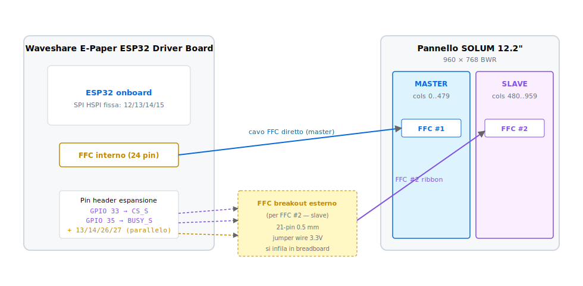
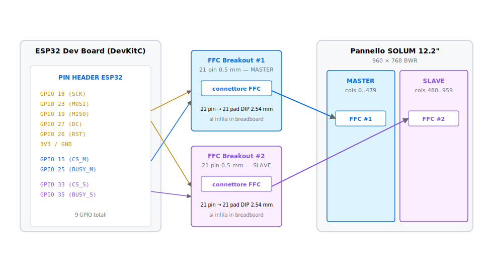

# GxEPD2_122c_SOLUM_960x768 — Driver custom

Driver header-only per pannello e-paper **SOLUM Newton-Core 12.2"**
(960×768 px, 3 colori nativi: bianco/nero/rosso, controller assumption
**UC8179 dual-controller**) su **ESP32**. Estende
[GxEPD2](https://github.com/ZinggJM/GxEPD2) di Jean-Marc Zingg, fornendo:

- **API `showImage()` unificata** come unico entry-point one-shot di
  stampa immagine. Due overload: descrittore generico (output dello
  script Python) e bitmap raw 1bpp B/N (formato
  [image2cpp](https://javl.github.io/image2cpp/));
- **2 API siblings uniformi** `writeImageBlack` / `writeImageRed` per
  scrittura single-channel (no `writeImageYellow`: il pannello 12.2"
  non supporta il giallo, a differenza del 9.7" del progetto);
- **sistema di descrittori universali** (`GxEPDImage::Descriptor`) con
  i soli formati BW e BWR (no BWRY);
- **dispatch dual-controller master/slave** trasparente al chiamante
  (split colonne 0..479 → master, 480..959 → slave) — `TODO[VERIFY]`
  al bring-up.

Per il contesto applicativo (sketch principale, moduli Weather/Calendar,
flussi di boot, OTA, ecc.) vedi [README principale del progetto](../README.md).

---

## Indice

- [Origine](#origine)
- [1. `GxEPDImage::showImage()` — unico entry-point pubblico](#1-gxepdimageshowimage--unico-entry-point-pubblico)
- [2. Due API siblings single-channel uniformi](#2-due-api-siblings-single-channel-uniformi)
- [3. Architettura dual-controller master/slave](#3-architettura-dual-controller-masterslave)
- [4. Sistema di descrittori universali (`namespace GxEPDImage`)](#4-sistema-di-descrittori-universali-namespace-gxepdimage)
- [5. Punti `TODO[VERIFY]` da validare al bring-up](#5-punti-todoverify-da-validare-al-bring-up)
- [6. Convivenza con il driver SOLUM 9.7"](#6-convivenza-con-il-driver-solum-97)
- [7. API completa](#7-api-completa)
- [8. Cablaggio hardware (Waveshare board / ESP32 Dev Board generica)](#8-cablaggio-hardware-waveshare-board--esp32-dev-board-generica)

---

## Origine

Il driver è **header-only** (`inline` nell'`.h`, nessuna `.cpp`) e nasce
come **strategia ibrida**: scheletro strutturale dual-controller dal
driver upstream
[`GxEPD2_1248c`](https://github.com/ZinggJM/GxEPD2/blob/master/src/epd3c/GxEPD2_1248c.cpp)
(pannello Good Display GDEY1248Z51 12.48" 3-colori, controller **UC8179**
master/slave), con porting integrale delle custom features dal driver
SOLUM 9.7" del progetto
[`GxEPD2_097c_SOLUM_672x960`](../GxEPD2_097c_SOLUM_672x960/README.md)
(`namespace GxEPDImage`, bulk-SPI, `_cleanAccentIfDirty`, page-hint,
`setPaged()` override).

### Perché 1248c e non 1330c

Il driver SOLUM 9.7" del progetto era stato fork dal
[`GxEPD2_1330c_GDEM133Z91`](https://github.com/ZinggJM/GxEPD2/blob/master/src/gdem3c/GxEPD2_1330c_GDEM133Z91.cpp)
(SSD1677, single-controller). Per il 12.2" la scelta del driver di
partenza è stata riconsiderata: il pannello Solum 12.2" presenta **2
cavi FFC da 21 pin**, evidenza fisica forte di un'architettura
**dual-controller master/slave**. Il 1330c non gestisce nativamente questo
pattern, mentre il 1248c sì.

| Criterio | 1330c (base 9.7") | **1248c (base 12.2")** |
|---|---|---|
| Cavi FFC supportati nativamente | 1 | **2** (master + slave) |
| Risoluzione driver | 960×680 | **1304×984** — più vicina al 12.2" in pixel count |
| Dimensione fisica panel | 13.3" | **12.48"** — quasi coincidente al 12.2" |
| Costruttore | `(cs, dc, rst, busy)` | **`(cs_m, cs_s, dc, rst, busy_m, busy_s)`** |
| Pattern split-buffer | assente | **implementato** (`_writeCommandAll`, `_writeCommandMaster`, `_waitWhileAnyBusy`, `ScreenPart`) |
| Controller IC | SSD1677 | UC8179 |

### Sequenza comandi UC8179

Il driver implementa la sequenza specifica del controller UC8179, portata
1:1 dal 1248c con i parametri di resolution adattati a 480×768 per
ScreenPart (split verticale del pannello 960×768):

- panel setting (`0x00 = 0x0f` master, `0x03` slave reverse scan)
- booster soft start (`0x06 = 0x27 0x27 0x18 0x17`)
- resolution setting (`0x61 = 0x01 0xE0 0x03 0x00` per ogni ScreenPart)
- DUSPI (`0x15 = 0x20`, single DIN)
- Vcom and data interval (`0x50 = 0x11 0x07`)
- TCON (`0x60 = 0x22`)
- cascade setting (`0xE0 = 0x03`)
- temperature (`0xE5`)
- power-on (`0x04`) / power-off (`0x02`)
- display refresh (`0x12`)
- deep sleep (`0x07 = 0xA5`)
- partial in/out (`0x91`/`0x92`) e partial window (`0x90`)

Rispetto ai driver stock di GxEPD2 per pannelli simili, questa versione
introduce le ottimizzazioni descritte nelle sezioni successive.

---

## 1. `GxEPDImage::showImage()` — unico entry-point pubblico

Free function template nel namespace `GxEPDImage` (vive nel driver `.h`):

```cpp
template<typename DisplayT>
void GxEPDImage::showImage(DisplayT& display,
                           const GxEPDImage::Descriptor& d,
                           int16_t x = 0, int16_t y = 0);
```

È **l'unica funzione pubblica per stampare un'immagine** sul pannello.
Va chiamata **dentro** un loop `firstPage()`/`nextPage()` del template
`GxEPD2_3C`, dopo `fillScreen()` e prima di `nextPage()`. Supporta i 2
formati del descrittore disponibili (BW / BWR — niente BWRY).

Pattern minimale one-shot:

```cpp
display.firstPage();
do {
  display.fillScreen(GxEPD_WHITE);
  GxEPDImage::showImage(display, *my_desc_ptr);
} while (display.nextPage());
display.hibernate();
```

Per immagini raw image2cpp B/N basta wrappare con la macro `GXEPD_BW_IMAGE`:

```cpp
GxEPDImage::showImage(display, GXEPD_BW_IMAGE(my_array, 960, 768));
```

Il chiamante è responsabile di: aprire il loop paged e chiamare
`hibernate()` se vuole spegnere il pannello.

**Multi-call per page.** `showImage` può essere chiamata 0, 1 o N volte
all'interno di una stessa iterazione del paged loop senza problemi: il
page-tracking interno avanza il counter solo quando il template chiude
la page (`writeImage(black, color)` chiamato da `nextPage()`), non a
ogni chiamata `showImage`. Utile per **compositing multi-immagine**:
sovrapporre più descrittori con offset `(x, y)` diversi, ognuno
disegnato correttamente nella sola porzione che intersecta la page
corrente. Vedi §3 "Loop pixel di `showImage` row-skip" per i dettagli
del meccanismo (identico al 9.7").

### Casi d'uso e firme

| # | Caso d'uso | Firma array (in `.h` incluso) | Firma chiamata |
|---|---|---|---|
| 1 | Bitmap **B/N raw** (image2cpp) | `const unsigned char img_xxx[] PROGMEM = { … };` | `GxEPDImage::showImage(display, GXEPD_BW_IMAGE(img_xxx, w, h));` |
| 2 | **BWR** da `epd_image_converter.pyw` | `const GxEPDImage::Descriptor img_xxx_desc;` *(auto-generato)* | `GxEPDImage::showImage(display, img_xxx_desc);` |
| 3 | **BWR raw inline** (2 piani separati) | `const unsigned char img_b[], img_r[] PROGMEM = { … };` | `GxEPDImage::showImage(display, GXEPD_BWR_IMAGE(img_b, img_r, w, h));` |
| 4 | **Single-channel diretto** (no GFX) | `const unsigned char img_b[], img_r[] PROGMEM = { … };` | `display.epd2.writeImageBlack(img_b, x, y, w, h, true);` + `…Red(…)` + `display.epd2.refresh(false);` |

Casi **1–3** vanno chiamati dentro un loop `firstPage()` / `nextPage()`
con `fillScreen()` prima, e seguiti da `display.hibernate()` se si vuole
spegnere il pannello.

Il caso **4** bypassa il template GFX e si chiama standalone (incluso
`refresh()` esplicito).

---

## 2. Due API siblings single-channel uniformi

I 2 canali del controller UC8179 sono esposti con shape identica per
scritture single-channel (no refresh):

```cpp
void writeImageBlack(const uint8_t* bitmap, int16_t x, int16_t y,
                     int16_t w, int16_t h, bool pgm = true);  // cmd 0x10
void writeImageRed  (const uint8_t* bitmap, int16_t x, int16_t y,
                     int16_t w, int16_t h, bool pgm = true);  // cmd 0x13
```

Convenzione bitmap input: bit=1 dove il pixel **non** appartiene a quel
canale (formato compatibile con lo script Python e image2cpp). Per
l'accent rosso il driver applica `~data` prima del transfer SPI per
allinearsi alla polarity nativa UC8179 (bit=1 in RAM = colorante acceso).

Differenza rispetto al 9.7": **nessuna** `writeImageYellow`. Il driver
12.2" è BWR-only, il quarto colore non è supportato dal pannello
Newton-Core. Stub no-op `isYellowPreserved()` / `writeImageYellow()`
sono presenti SOLO per ODR-compatibility con il template `showImage<>`
del 9.7" se entrambi gli header finissero inclusi nello stesso TU
(scenario non supportato — vedi §6).

---

## 3. Architettura dual-controller master/slave

A differenza del 9.7" (single-controller SSD1677), il 12.2" è pilotato
da **2 controller UC8179** in configurazione master/slave, ciascuno
collegato a uno dei 2 cavi FFC da 21 pin del pannello.

### ScreenPart inner class

Il driver introduce una inner class `ScreenPart` (pattern preso dal
1248c, dove sono 4 ScreenPart M1/S1/M2/S2; qui semplificato a 2 → M, S).
Ogni `ScreenPart` gestisce le scritture verso un singolo controller:

- proprio CS, DC condiviso col master (i 2 controller condividono SCK,
  MOSI, MISO, DC, RST a livello hardware);
- `WIDTH` e `HEIGHT` riferiti alla **metà** del pannello che gestisce;
- flag `_rev_scan` per applicare reverse scan ai pixel della metà
  destra (cmd 0x00 panel setting con valore `0x03` invece di `0x0f`).

### Split del frame buffer

`TODO[VERIFY]` Assumption iniziale: **split verticale** delle colonne.

```
                  WIDTH = 960
   ┌─────────────────────┬─────────────────────┐
   │                     │                     │
   │   MASTER (cs_m)     │   SLAVE (cs_s)      │  HEIGHT = 768
   │   columns 0..479    │   columns 480..959  │
   │   480 × 768         │   480 × 768         │
   │   FFC #1            │   FFC #2            │
   │                     │                     │
   └─────────────────────┴─────────────────────┘
```

Coerente col pattern del 1248c che mette M1/M2 a sinistra e S1/S2 a
destra. Se al bring-up solo metà del display si aggiorna o ci sono
artefatti sulla giunzione, valutare:

- swap master ↔ slave (cs_m e cs_s scambiati a livello hardware);
- split orizzontale (master = righe 0..383 alto, slave = 384..767);
- reverse scan diverso (cmd 0x00 panel setting: scambiare 0x0f ↔ 0x03).

### Dispatch outer-class

L'outer class `GxEPD2_122c_SOLUM_960x768` espone un'API GxEPD2 standard
(`writeImage`, `writeImagePart`, ecc.) e internamente fa dispatch verso
le 2 ScreenPart:

```cpp
M.writeImagePart(command, bitmap, ..., x, y, ...);
S.writeImagePart(command, bitmap, ..., x - M.WIDTH, y, ...);
```

Le coordinate `x` per lo slave sono traslate di `-M.WIDTH` per
riallinearle al sistema di coordinate locale dello slave (0..479).

Per i comandi globali (init, power, refresh) il driver fornisce 2
helper `_writeCommandAll(uint8_t)` / `_writeDataAll(uint8_t)` che
abbassano simultaneamente CS_M e CS_S, in modo che entrambi i controller
ricevano lo stesso comando in parallelo. Il busy wait usa il pattern
`_waitWhileAnyBusy` che attende OR-degli-AND-negati: usciamo solo
quando NESSUNO dei due controller è busy.

### Modalità single-CS per bring-up

Per il bring-up iniziale è disponibile una variante di costruttore
`(cs, dc, rst, busy)` che cabla solo il master (slave passato a `-1`).
In questa modalità la `ScreenPart S` ritorna `isActive() == false` e
tutte le scritture verso lo slave vengono saltate. Permette di
validare il primo controller in isolamento prima di cablare il secondo.

---

## 4. Sistema di descrittori universali (`namespace GxEPDImage`)

```cpp
namespace GxEPDImage {
  enum Format : uint8_t {
    FORMAT_BW_1BPP   = 0,   // 1 buffer 1bpp (compat image2cpp)
    FORMAT_BWR_1BPP  = 1,   // buffer separati black + red
    // FORMAT_BWRY_1BPP NON disponibile: pannello 12.2" non supporta yellow
  };

  struct Descriptor {
    Format format;
    uint16_t width, height;
    const uint8_t *data0, *data1, *data2;  // data2 ignorato (no yellow)
  };
}
```

Il descrittore porta con sé formato e dimensioni. Per costruire
descrittori inline lo header espone due macro di comodo:

```cpp
GXEPD_BW_IMAGE(ptr, w, h)
GXEPD_BWR_IMAGE(black, red, w, h)
```

(La macro `GXEPD_BWRY_IMAGE` del 9.7" qui **non** è definita.)

Lo script Python `epd_image_converter.pyw` genera automaticamente una
variabile `img_<nome>_desc` ad ogni conversione, pronta per essere
passata a `showImage()`. Per il 12.2" lo script va invocato con il
flag BWR (no canale giallo).

---

## 5. Punti `TODO[VERIFY]` da validare al bring-up

Il datasheet
[Newton-Core_Specifications.pdf](../Newton-Core_Specifications.pdf) è
materiale marketing e **non dichiara**:

1. Il **controller IC** del pannello.
2. La **divisione fisica** dei 2 FFC sui pixel.
3. La sequenza di **init e LUT** specifica del pannello.

Il driver implementa una serie di assumption marcate `TODO[VERIFY]` da
confermare con hardware reale al bring-up:

| TODO | Default | Sintomo se sbagliato | Mitigazione |
|---|---|---|---|
| Controller IC | UC8179 (sequenza 1248c) | Pannello non risponde, busy mai rilasciato | Sostituire `_InitDisplay`/`_PowerOn`/`_PowerOff`/`_Update_Full`/`hibernate` con sequenza SSD1677 dal 9.7" |
| Split master/slave | Verticale: M = colonne 0..479, S = colonne 480..959 | Solo metà schermo aggiorna | Swap M↔S oppure split orizzontale (righe 0..383 / 384..767) |
| Reverse scan slave | M = `0x0f` (normal), S = `0x03` (reverse) | Metà destra appare specchiata | Scambiare i valori al cmd `0x00` panel setting in `_InitDisplay` |
| Resolution setting | cmd `0x61` = 480×768 per ogni controller | Bordo nero o artefatti sulla giunzione | Verificare i 4 byte BE (0x01 0xE0 / 0x03 0x00) |
| Booster soft start | `0x27 0x27 0x18 0x17` (cmd `0x06`) | Contrasto basso o ghosting | Calibrare leggendo il datasheet UC8179 |
| Refresh time | `full_refresh_time = 25000` ms | Refresh interrotto a metà o timeout | Aumentare a 30000 ms se persiste |
| LUT | OTP del controller (no LUT custom) | Ghosting visibile | Scrivere LUT esplicite dal datasheet UC8179 |

---

## 6. Convivenza con il driver SOLUM 9.7"

Il 9.7" e il 12.2" definiscono entrambi un namespace `GxEPDImage` con
contenuto **diverso** (il 9.7" include `FORMAT_BWRY_1BPP`, il 12.2"
no). Includere ENTRAMBI gli header nello stesso TU produrrebbe
ridefinizione del namespace → errore di compilazione.

In un progetto che usa entrambi i pannelli, mantenere gli include in
**TU separati** (un file `.cpp` per il 9.7", un altro per il 12.2") oppure
**scegliere quale dei due includere a runtime** tramite preprocessor
flags:

```cpp
#if defined(USE_SOLUM_122)
  #include <GxEPD2_122c_SOLUM_960x768.h>
  using DisplayDriver = GxEPD2_122c_SOLUM_960x768;
#else
  #include <GxEPD2_097c_SOLUM_672x960.h>
  using DisplayDriver = GxEPD2_097c_SOLUM_672x960;
#endif

GxEPD2_3C<DisplayDriver, DisplayDriver::HEIGHT / 8>
    display(DisplayDriver(/*pinout*/));
```

Il driver 12.2" definisce stub `isYellowPreserved()` e `writeImageYellow()`
**no-op** per garantire ODR-compatibility se per qualche ragione il
template `showImage<>` del 9.7" finisse istanziato col tipo del 12.2"
(es. inclusione accidentale di entrambi gli header in un build con
controlli di compilazione lassi). A runtime non vengono mai chiamati per
il 12.2" perché `FORMAT_BWRY_1BPP` non è nemmeno definito qui.

---

## 7. API completa

La lista degli overload `drawImage*` / `writeImage*` / `writeImagePart*`
ereditati dalla base class è documentata in
[../GxEPD2_097c_SOLUM_672x960/drawImage_overloads_it.md](../GxEPD2_097c_SOLUM_672x960/drawImage_overloads_it.md)
(o la versione inglese
[../GxEPD2_097c_SOLUM_672x960/drawImage_overloads.md](../GxEPD2_097c_SOLUM_672x960/drawImage_overloads.md))
— le firme sono identiche per i 2 driver, cambia solo l'implementazione
sottostante (single-controller SSD1677 nel 9.7", dual-controller UC8179
qui).

Sono override di virtual del base class `GxEPD2_EPD` necessari al
contratto della libreria — non sono pensati per uso diretto: lo sketch
chiama `showImage()` per immagini singole, oppure il template
`GxEPD2_3C` invoca `writeImagePart(black, color)` durante il flusso
paged.

Differenze API rispetto al 9.7":

| API | 9.7" | 12.2" |
|---|---|---|
| `clearScreen(value)` | ✓ | ✓ |
| `clearScreen(black, color)` | ✓ | ✓ |
| `clearScreen(black, color, yellow)` | ✓ | **assente** |
| `writeScreenBuffer(value)` | ✓ | ✓ |
| `writeScreenBuffer(black, color)` | ✓ | ✓ |
| `writeScreenBuffer(black, color, yellow)` | ✓ | **assente** |
| `writeImageBlack` | ✓ (cmd 0x24) | ✓ (cmd 0x10) |
| `writeImageRed` | ✓ (cmd 0x26) | ✓ (cmd 0x13) |
| `writeImageYellow` | ✓ (cmd 0x28) | **stub no-op** |
| `preserveYellow` / `isYellowPreserved` | ✓ | **stub** (sempre `true`) |
| `setPaged()` override | ✓ | ✓ |
| `showImagePageHint()` getter | ✓ | ✓ |
| Bulk-SPI `writeBytes` | ✓ | ✓ |
| Dual-controller dispatch | n/a | ✓ (M + S) |
| Costruttore single-CS bring-up | n/a | ✓ |

---

## 8. Cablaggio hardware (Waveshare board / ESP32 Dev Board generica)

> Questa sezione è la versione Markdown della pagina HTML interattiva
> [connessioni.html](connessioni.html). I diagrammi sono file SVG
> separati ([cablaggio_waveshare.svg](cablaggio_waveshare.svg) e
> [cablaggio_devboard.svg](cablaggio_devboard.svg)) per garantire il
> rendering corretto sia in VS Code Markdown preview sia su GitHub. La
> pagina HTML standalone offre stile più ricco (dark theme, code
> highlighting, anchor links) ed è consigliata per la consultazione
> offline; il contenuto tecnico è lo stesso di questa sezione.

### Concetti chiave

Il pannello ha **2 cavi FFC da 21 pin**: ognuno porta a uno dei due
controller IC (master / slave) integrati nel pannello stesso. Per
pilotarlo da un solo ESP32 servono 9 pin GPIO totali:

- 🟧 **5 condivisi** (`SCK`, `MOSI`, `DC`, `RST`, più `VCC` e `GND`):
  un solo pin GPIO ESP32, che si dirama in parallelo verso entrambi i FFC;
- 🟦 **2 dedicati al master** (`CS_M`, `BUSY_M`): solo verso FFC #1;
- 🟪 **2 dedicati allo slave** (`CS_S`, `BUSY_S`): solo verso FFC #2.

`MISO` non è obbligatorio per il driver ma alcuni layout lo richiedono
per leggere temperatura / OTP del controller.

### Setup A — Waveshare E-Paper ESP32 Driver Board

Riferimento:
[prodotto Waveshare](https://www.waveshare.com/e-paper-esp32-driver-board.htm) ·
[wiki](https://www.waveshare.com/wiki/E-Paper_ESP32_Driver_Board).
La board ha **un solo connettore FFC interno** con pinout SPI
hardware-cablata. Il FFC interno pilota il **master**; per lo
**slave** servono 2 GPIO liberi presi dai pin header laterali e un
secondo connettore FFC esterno cablato a mano.



| Segnale | GPIO ESP32 | Sorgente | Destinazione | Tipo |
|---|---|---|---|---|
| SCK | 13 | FFC interno + jumper | FFC #1 + FFC #2 | 🟧 condiviso |
| MOSI (DIN) | 14 | FFC interno + jumper | FFC #1 + FFC #2 | 🟧 condiviso |
| DC | 27 | FFC interno + jumper | FFC #1 + FFC #2 | 🟧 condiviso |
| RST | 26 | FFC interno + jumper | FFC #1 + FFC #2 | 🟧 condiviso |
| 3V3 / GND | — | FFC interno + jumper | FFC #1 + FFC #2 | 🟧 condiviso |
| **CS_M** | 15 | FFC interno della board | FFC #1 | 🟦 master |
| **BUSY_M** | 25 | FFC interno della board | FFC #1 | 🟦 master |
| **CS_S** | 33 | Pin header espansione | FFC #2 esterno | 🟪 slave |
| **BUSY_S** | 35 | Pin header espansione | FFC #2 esterno | 🟪 slave |

Costruttore corrispondente:

```cpp
#include "GxEPD2_122c_SOLUM_960x768.h"

GxEPD2_3C<GxEPD2_122c_SOLUM_960x768,
          GxEPD2_122c_SOLUM_960x768::HEIGHT / 8>
    display(GxEPD2_122c_SOLUM_960x768(
        /*sck   */ 13,
        /*miso  */ 12,    // -1 se non si legge dal controller
        /*mosi  */ 14,
        /*cs_m  */ 15,    // FFC interno della board
        /*cs_s  */ 33,    // FFC esterno cablato a mano
        /*dc    */ 27,
        /*rst   */ 26,
        /*busy_m*/ 25,
        /*busy_s*/ 35));
```

> ⚠️ **Caveat board Waveshare.** Il connettore FFC interno è 24-pin
> standard Waveshare; i FFC del Solum 12.2" sono 21-pin. Verifica con
> multimetro la corrispondenza pin-a-pin prima di alimentare —
> tipicamente serve un adattatore 24→21 pin tra la board e il FFC del
> Solum.

### Setup B — ESP32 Dev Board generica + 2 FFC breakout 0.5 mm

Per chi parte da una **ESP32 Dev Board nuda** (es. ESP32-WROOM-32 DevKitC,
NodeMCU-32S, ecc.) e **2 FFC breakout 0.5 mm a 21 pin** (reperibili su
AliExpress / Amazon, ~5 € la coppia). Più flessibile della Waveshare board:
pinout SPI scegliibile, FFC simmetrici (no adattatore), tutti i 9 GPIO
accessibili sui pin header DIP.



| Segnale | GPIO ESP32 | Cablaggio | Tipo |
|---|---|---|---|
| SCK | 18 (VSPI default) | jumper a entrambi i breakout | 🟧 condiviso |
| MOSI (DIN) | 23 | jumper a entrambi i breakout | 🟧 condiviso |
| MISO | 19 (opzionale) | jumper a entrambi i breakout | 🟧 condiviso |
| DC | 27 | jumper a entrambi i breakout | 🟧 condiviso |
| RST | 26 | jumper a entrambi i breakout | 🟧 condiviso |
| 3V3 / GND | — | rail breadboard a entrambi i breakout | 🟧 condiviso |
| **CS_M** | 15 | jumper al breakout #1 | 🟦 master |
| **BUSY_M** | 25 | jumper al breakout #1 | 🟦 master |
| **CS_S** | 33 | jumper al breakout #2 | 🟪 slave |
| **BUSY_S** | 35 | jumper al breakout #2 | 🟪 slave |

Costruttore corrispondente (SPI default VSPI):

```cpp
GxEPD2_3C<GxEPD2_122c_SOLUM_960x768,
          GxEPD2_122c_SOLUM_960x768::HEIGHT / 8>
    display(GxEPD2_122c_SOLUM_960x768(
        /*cs_m  */ 15, /*cs_s  */ 33,
        /*dc    */ 27, /*rst   */ 26,
        /*busy_m*/ 25, /*busy_s*/ 35));
```

> ✅ **Setup consigliato per il bring-up.** Tutti i segnali sono fisicamente
> accessibili con sonda logica / oscilloscopio sui pin della breadboard,
> e si possono swappare velocemente master ↔ slave scollegando 2 jumper
> invece di rifare il PCB.

### Strategia di bring-up step-by-step

1. **Step 1 — solo master cablato.** Collega solo il FFC #1, lascia il #2
   staccato. Usa il costruttore single-CS:
   ```cpp
   display(GxEPD2_122c_SOLUM_960x768(/*cs=*/15, /*dc=*/27, /*rst=*/26, /*busy=*/25));
   ```
   Risultato atteso: la metà sinistra (cols 0..479) si aggiorna, la metà
   destra resta scura/random. Conferma: init UC8179 OK, BUSY rilasciato
   entro ~25 s, refresh time ragionevole.
2. **Step 2 — entrambi i controller cablati.** Se la metà destra non
   funziona, prova nell'ordine:
   - swap CS_M ↔ CS_S (inverti i 2 jumper);
   - cambia il valore reverse-scan in `_InitDisplay()` (`0x00 = 0x03` →
     `0x0f` per lo slave);
   - se i pixel sono "scambiati di posizione" tra le metà, lo split fisico
     è per riga invece che per colonna — vedi sezione 5.

### Approvigionamento breakout FFC: usare 22 / 24 pin con 1 pin libero

I breakout FFC 0.5 mm a **21 pin esatti** non sono uno standard di mercato:
in pratica si trovano solo a **20 pin** (standard "TFT panel") o a **22 / 24
pin**. La soluzione pratica è **usare un breakout da 22 o 24 pin lasciando
1 (o più) pin scoperto su un lato**.

> ⚠️ **Errore catastrofico da evitare.** Uno shift di 1 pin = pinout
> completamente sbagliata = potenziale corto su `VCC` / `GND` distruttivo
> per il controller del pannello. Il protocollo di verifica multimetro qui
> sotto è **obbligatorio** prima di alimentare.

#### Allineamento corretto

Il FFC a 21 pin si infila nel connettore da 22 (o 24) pin allineato a **un
solo lato**, lasciando 1 (o 3) pin liberi sul lato opposto:

```
Connettore 22 pin del breakout (vista dall'alto):
┌─────────────────────────────────────────┐
│ 1  2  3  4  5  6  7 ... 20 21 22        │
│ ▒  ▒  ▒  ▒  ▒  ▒  ▒      ▒  ▒  ░        │  ░ = pin lasciato libero
│ │  └──────── 21 pad del FFC ─────┘      │  ▒ = pad del FFC
│ pin 1 del FFC                pin 21     │
└─────────────────────────────────────────┘
              allinea a SINISTRA (pin 22 libero)


Connettore 24 pin del breakout (configurazione consigliata):
┌────────────────────────────────────────────────┐
│ 1  2  3  4  5  6  7 ... 20 21 22 23 24         │
│ ▒  ▒  ▒  ▒  ▒  ▒  ▒      ▒  ▒  ░  ░  ░         │
│ │  └──── 21 pad del FFC ─────┘                 │
│ pin 1 del FFC          pin 21                  │
└────────────────────────────────────────────────┘
              allinea a SINISTRA (pin 22-24 liberi)
```

**Quale lato scegliere?** Tipicamente il pin 1 del FFC è marcato con un
triangolino bianco/blu sul ribbon. Allineamento standard: il pin 1 del FFC
va sul pin 1 del connettore. Quindi **lascia liberi i pin in eccesso
sull'estremità opposta**. Se la marcatura non è visibile, il pin 1 del FFC
è quasi sempre `VCC` o `GND` — si capisce con multimetro.

#### Procedura di verifica multimetro (obbligatoria)

1. **Inserisci il FFC nel breakout** allineato come deciso (es. tutto a
   sinistra, sui pin 1..21).
2. **Multimetro in continuità (beep test):** misura tra il pin 1 del
   breakout (uscita DIP 2.54 mm) e ciascun pad esposto del FFC dal lato
   opposto. Quello che dà beep è la giunzione. Verifica che corrisponda
   davvero al pin 1 del FFC come previsto dal datasheet del pannello.
3. **Test alimentazione (resistenza):** identifica `VCC` e `GND` del FFC
   (di solito i pin estremi o adiacenti). Misura con multimetro in
   resistenza tra questi 2:
   - se dà ~0 Ω → **CORTO**, il FFC è inserito al contrario o shifted, NON ALIMENTARE;
   - se dà alcune centinaia di kΩ o ∞ → OK, prosegui.
4. Solo se il test passa, applica i 3.3V con un alimentatore current-limited
   (es. ~100 mA) per i primi secondi e verifica che la corrente assorbita
   sia ragionevole (decine di mA a riposo).

#### Tabella alternative

| Soluzione | Pro | Contro |
|---|---|---|
| **Breakout 22 pin, 1 pin libero** | Esatto count + 1, allineamento più sicuro (solo 1 pin in eccesso) | Meno comuni dei 24-pin |
| **Breakout 24 pin, 3 pin liberi** ⭐ | Standard di mercato, facile da trovare (è lo stesso connettore Waveshare) | 3 pin liberi richiedono attenzione extra all'allineamento |
| **Breakout "universale" 30 pin** | Copre anche pannelli più larghi futuri | Spazio sprecato in breadboard |
| **Breakout 20 pin + taglio FFC** | Economico | **Distruttivo**, si perde 1 segnale, sconsigliato senza datasheet che confermi che il pin tagliato è NC |
| **PCB custom 21 pin (Hirose FH12-21S-0.5SH)** | Soluzione definitiva, dimensione esatta | 1-2 settimane consegna, richiede KiCad/EasyEDA |

⭐ **Soluzione consigliata**: breakout 24 pin. Sono lo stesso passo del
connettore FFC interno della Waveshare board (24 pin 0.5 mm), facilissimi da
reperire su AliExpress / Amazon a ~3 € l'uno. Cerca *"24 pin 0.5 mm FPC
connector breakout DIP"*. Per il setup B servono **2 unità**.

#### Verifica preliminare obbligatoria

Prima di acquistare, misura con un calibro la **larghezza del FFC** del
Solum 12.2":

- 21 pin a **0.5 mm pitch** → larghezza ~11.5 mm (= 21 × 0.5 + margine);
- 21 pin a **1.0 mm pitch** → larghezza ~21 mm.

Se misuri ~21 mm il pitch è 1.0 mm e servono breakout 1.0 mm (raro su
pannelli moderni ma capita su ESL vecchi).

### Caveat hardware riassunti

| Categoria | Vincolo |
|---|---|
| **Tensione** | Pannello NON 5V tolerant. VCC + tutte le data line a 3.3V. |
| **Lunghezza jumper** | < 10 cm consigliato. > 15 cm → ringing visibile a 20 MHz. Se i byte SPI sono corrotti, abbassa il clock SPI. |
| **Alimentazione** | Pacco da 6× CR2450 da datasheet → assorbimento non banale. Se la 3V3 cala sotto 3.0V durante refresh, alimenta il pannello da fonte esterna 3.3V. |
| **GPIO 35 input-only** | OK per BUSY_S, NON usabile per CS_S. Per CS_S serve un GPIO output-capable (4, 5, 16, 17, 21, 22, 32, 33). |
| **Strapping pins** | GPIO 0, 2, 5, 12, 15 sono strapping. GPIO 15 (CS_M) è OK perché parte HIGH. Evita di mettere il pannello su GPIO 0, 2, 12. |
