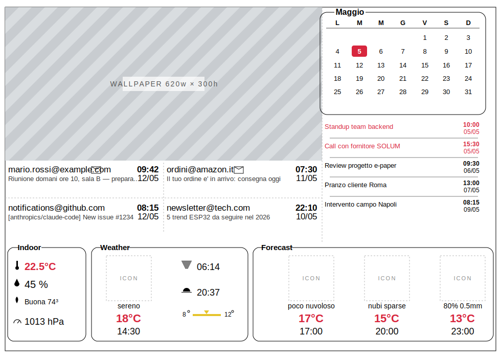

# ePaper-9.7

Firmware Arduino/ESP32 + tool Python per pilotare display e-paper a colori
tramite la libreria [GxEPD2](https://github.com/ZinggJM/GxEPD2) di
Jean-Marc Zingg. Il repository include un **driver custom esteso** per il
pannello SOLUM ESL 9.7" (672×960, controller SSD1677, **4 colori nativi**:
bianco, nero, rosso, giallo) che aggiunge:

- una **API `showImage()` unificata** come unico entry-point one-shot di
  stampa immagine, con hibernate automatico opzionale. Due overload:
  descrittore generico (output dello script Python) e bitmap raw 1bpp
  B/N (formato [image2cpp](https://javl.github.io/image2cpp/));
- **3 API siblings uniformi** `writeImageBlack` / `writeImageRed` /
  `writeImageYellow` per scrittura single-channel, usate nel flusso
  paged con yellow iniettato "out-of-band" (vedi [sezione dedicata](GxEPD2_SOLUM_097c_960x672/README.md#3-perché-il-yellow-è-out-of-band-nel-flusso-paged));
- un **sistema di descrittori universale** (`GxEPDImage::Descriptor`) che
  porta con sé formato e dimensioni dell'immagine (BW / BWR / BWRY);
- **supporto nativo al 4° colore** (giallo) sul comando `0x28` del
  controller SSD1677 — verificato su hardware.

Lo sketch principale compone uno schermo completo con:

- **background cinema scaricato via HTTP** dalla webapp
  [`webapp/`](webapp/) (collage locandine + orari del prossimo martedì);
  fetch una tantum al primo boot con WiFi su, immagine tenuta in RAM/PSRAM
  per tutti i refresh successivi. Se il fetch fallisce o il WiFi non c'è
  si usa il fallback PROGMEM [`img_test/img_apple_bwry.h`](img_test/img_apple_bwry.h).
  Vedi [Background cinema](#background-cinema);
- **banner meteo** in basso, 3 riquadri in stile "fieldset" (titolo sul
  bordo): **Indoor** (BME680, 1 colonna × 4 righe: T/RH/IAQ/pressione),
  **Weather** (meteo corrente OWM + sub-colonna sun a destra:
  alba/tramonto + 2 placeholder), **Forecast** (3 previsioni OWM);
- **calendario** del mese corrente in alto a destra, bordi arrotondati
  in stile fieldset (nome del mese sul bordo superiore) e data odierna
  in rosso pieno (`fillRoundRect`);
- **lista eventi** (5 slot) sotto al calendario, fusione di **Outlook**
  (Microsoft Graph) e **Google Calendar** ordinati per inizio: gli
  eventi di oggi sono colorati in rosso, gli altri in nero, con evento
  in corso (end nel futuro) mantenuto fino al termine effettivo;
- **lettura ultime mail Gmail** in cache (default 5 mail, INBOX).
  Modulo `Mail.h` solo download/cache: per ora **niente UI**, predisposto
  per il rendering futuro. Vedi [Mail (`Mail.h`)](#mail-mailh);
- **localizzazione Europe/Rome** con **DST automatico** (POSIX TZ
  impostato da `Calendar::initTimezone()` in `setup()`);
- **finestra OTA** al boot (default 3 min, `OTA_WINDOW_MIN`) via AP WiFi
  dedicato, per aggiornare il firmware da campo senza smontare il device.

Il convertitore Python con GUI permette di produrre in modo rapido tutti
i formati supportati (B/N, BWR, BWRY), con preset dimensionali per SOLUM
672×960 e GDEY0420F51 400×300 e anteprima automatica che si aggiorna ad
ogni modifica dei parametri.

---

## Indice

- [Hardware supportato](#hardware-supportato)
- [Struttura del repository](#struttura-del-repository)
- [Configurazione (Env.h)](#configurazione-envh)
- [Driver custom GxEPD2_SOLUM_097c_960x672](#driver-custom-gxepd2_solum_097c_960x672) (→ [doc dedicata](GxEPD2_SOLUM_097c_960x672/README.md))
- [Moduli applicativi](#moduli-applicativi)
- [Sketch principale](#sketch-principale)
- [Flussi di boot e timeout](#flussi-di-boot-e-timeout)
- [Background cinema](#background-cinema)
- [Rate limit API esterne](#rate-limit-api-esterne)
- [Convertitore immagini Python](#convertitore-immagini-python)
- [Build e flash](#build-e-flash)
- [Crediti](#crediti)
- [Licenza](#licenza)

---

## Hardware supportato

| Pannello | Risoluzione | Colori | Controller | Note |
|----------|------------|--------|------------|------|
| **SOLUM ESL 9.7"** | 672 × 960 | B/N + rosso + giallo (nativi) | SSD1677 | Driver custom incluso. 4° colore via comando `0x28` confermato su HW |
| Good Display **GDEY0420F51** | 400 × 300 | B/N + rosso + giallo (nativi) | HX8717 | Supportato via `GxEPD2_4C` upstream; nel convertitore è disponibile il preset dimensionale 400×300 |

Scheda di pilotaggio di riferimento: **Waveshare E-Paper ESP32 Driver Board**
(piedinatura HSPI nello sketch: `SCK=13, MISO=12, MOSI=14, CS=15, DC=27, RST=26, BUSY=25`).

---

## Struttura del repository

```
.
├── GxEPD2_SOLUM_097c_960x672/      # Cartella driver SOLUM 9.7"
│   ├── GxEPD2_SOLUM_097c_960x672.h     # Driver custom header-only (classe + namespace GxEPDImage)
│   ├── README.md                       # Documentazione dedicata del driver
│   ├── drawImage_overloads.md          # Lista signature drawImage* (EN)
│   └── drawImage_overloads_it.md       # Idem in italiano
├── GxEPD2_1330c_GDEM133Z91.ino     # Sketch principale: orchestra Weather/Calendar/Ota
├── Env.h                           # Segreti (WiFi, OWM, OTA, OAuth) + posizione GPS
├── Weather.h                       # Fetch OWM + rendering banner meteo (4 blocchi)
├── Calendar.h                      # Mese + lista eventi Outlook+Google + TZ Europe/Rome
├── Mail.h                          # Lettura ultime N mail Gmail via batch endpoint (cache only, no UI)
├── Indoor.h                        # Sensore BME680 via I2C (BSEC2 ULP, IAQ+T+RH, persistenza NVS)
├── Ota.h                           # Finestra OTA (OTA_WINDOW_MIN, default 3 min) via AP WiFi dedicato
├── Graphics.h                      # Utility di disegno condivise (drawFieldsetRect)
├── icons.h                         # Bitmap icone meteo indicizzate per icon code OWM
├── preview.html                    # Anteprima statica HTML del layout 960x672
├── epd_image_converter.pyw         # Convertitore GUI Python -> array .h
├── img_test/
│   └── img_apple_bwry.h            # Fallback wallpaper 4-colori (offline) + descrittore
├── webapp/                         # Webapp FastAPI cinema (vedi webapp/README.md)
├── LICENSE
└── README.md
```

---

## Configurazione (Env.h)

`Env.h` raccoglie i **segreti** (credenziali WiFi, API key
OpenWeatherMap, password dell'AP OTA, client-secret e refresh-token
OAuth) e la **posizione GPS** (dato personale, accoppiato alla chiave
OWM). Le costanti di dominio non-sensibili stanno nei moduli consumer:
`CAL_POSIX_TZ` (Europe/Rome con DST automatico) e
`CAL_MSGRAPH_TENANT_ID` in `Calendar.h`.

```cpp
#ifndef ENV_H
#define ENV_H

/* --- Rete WiFi di casa (STA) --- */
#define WIFI_SSID       "my_network"
#define WIFI_PASSWORD   "my_password"

/* --- OpenWeatherMap --- */
#define OWM_API_KEY     "my_api_key"
#define LAT             41.9028f    /* Roma */
#define LON             12.4964f

/* --- Access Point esposto al boot per l'OTA (WPA2 min 8 char) --- */
#define OTA_AP_SSID     "ePaper-OTA"
#define OTA_AP_PASSWORD "change_me_min8"

/* --- Microsoft Graph (Outlook) --- */
#define MSGRAPH_CLIENT_ID     "00000000-0000-0000-0000-000000000000"
#define MSGRAPH_REFRESH_TOKEN "paste_refresh_token_here"

/* --- Google Calendar API v3 --- */
#define GOOGLE_CLIENT_ID      "xxxx-yyyy.apps.googleusercontent.com"
#define GOOGLE_CLIENT_SECRET  "paste_client_secret_here"
#define GOOGLE_REFRESH_TOKEN  "paste_refresh_token_here"

#endif
```

| Define                  | Obbligatorio | Note                                                   |
|-------------------------|:-:|-------------------------------------------------------------------|
| `WIFI_SSID`             | si | SSID della rete di casa (STA).                                   |
| `WIFI_PASSWORD`         | si | Password WPA/WPA2 della rete di casa.                            |
| `OWM_API_KEY`           | si | API key gratuita OpenWeatherMap.                                 |
| `LAT` / `LON`           | si | Latitudine e longitudine (float) per la query meteo.             |
| `OTA_AP_SSID`           | si | SSID esposto dal device al boot per l'OTA.                       |
| `OTA_AP_PASSWORD`       | si | Minimo 8 caratteri (limite WPA2). Unico gate sulla `/update`.    |
| `MSGRAPH_CLIENT_ID`     | opz | Client pubblico Azure AD con scope `Calendars.Read offline_access`. Omettere tutti e due i MSGRAPH_* se non si usa Outlook. |
| `MSGRAPH_REFRESH_TOKEN` | opz | Refresh token ottenuto da PC via MSAL.                          |
| `GOOGLE_CLIENT_ID`      | opz | Client OAuth "Desktop app" da Google Cloud Console. Omettere tutti e tre i GOOGLE_* se non si usa ne' Google Calendar ne' Gmail. |
| `GOOGLE_CLIENT_SECRET`  | opz | Client secret della stessa app.                                 |
| `GOOGLE_REFRESH_TOKEN`  | opz | Refresh token con scope `calendar.readonly` **e/o** `gmail.readonly` (vedi sotto). |

> ℹ️ **Refresh token Google condiviso fra Calendar e Mail**. `Mail.h` riusa
> `GOOGLE_CLIENT_ID`, `GOOGLE_CLIENT_SECRET` e `GOOGLE_REFRESH_TOKEN`: se
> abiliti entrambi i moduli (Calendar Google + Mail), il refresh_token deve
> essere stato emesso con **scope unificati** `calendar.readonly` +
> `gmail.readonly`. Per aggiungere il modulo Mail a un progetto che gia'
> usa il Calendar: ri-esegui il flusso OAuth (con `prompt=consent`)
> chiedendo entrambi gli scope, sostituisci `GOOGLE_REFRESH_TOKEN` con il
> nuovo valore e abilita la **Gmail API** sullo stesso progetto Cloud.

I parametri **non-sensibili e non-accoppiati ai segreti** (fuso orario,
tenant Azure pubblico) non stanno in `Env.h` ma nei moduli consumer:
`CAL_POSIX_TZ` e `CAL_MSGRAPH_TENANT_ID` in `Calendar.h`. Allo stesso
modo la configurazione hardware del BME680 (`BME680_I2C_ADDR`,
`BME680_SDA_PIN`, `BME680_SCL_PIN`) vive in [`Indoor.h`](Indoor.h): sono
costanti locali al modulo, non segreti.

> ⚠️ **Non committare `Env.h`** dopo averlo editato. Tenerlo locale e
> considerare l'uso di una copia `Env.example.h` di riferimento.

---

## Driver custom GxEPD2_SOLUM_097c_960x672

Il driver è **header-only** (`inline` nell'`.h`, nessuna `.cpp`) e nasce
come fork di
[`GxEPD2_1330c_GDEM133Z91`](https://github.com/ZinggJM/GxEPD2/blob/master/src/epd3c/GxEPD2_1330c_GDEM133Z91.cpp)
(pannello Good Display 13.3" 3-colori, stesso controller SSD1677).
Implementa la sequenza di comandi specifica del SOLUM 9.7" e introduce
**4 estensioni** rispetto ai driver stock di GxEPD2:

1. **`GxEPDImage::showImage()`** — unica funzione pubblica per stampare
   un'immagine, supporta BW / BWR / BWRY con yellow gestito internamente.
2. **API single-channel** `writeImageBlack` / `writeImageRed` /
   `writeImageYellow` per scrittura diretta sul controller.
3. **Pattern "yellow out-of-band"** — il giallo (`0x28`) viene iniettato
   prima del loop paged e protetto via `preserveYellow(true)`, perchè il
   template upstream `GxEPD2_3C` ha un'architettura hard-coded a 2 canali.
4. **Sistema di descrittori universali** (`GxEPDImage::Descriptor`) con
   formato + dimensioni dell'immagine (BW / BWR / BWRY).

Lista completa di tutto: motivazione, API, esempi d'uso (7 casi), pitfall
sul `drawPixel(GxEPD_YELLOW)`, ottimizzazioni rispetto al driver stock
(tabella 14 righe + dettaglio bullet), tracking della page corrente
parallelo a `_current_page` privato del template, in:

> 📘 **[GxEPD2_SOLUM_097c_960x672/README.md](GxEPD2_SOLUM_097c_960x672/README.md)** — documentazione dedicata del driver custom.

---

## Moduli applicativi

Oltre al driver e al convertitore, lo sketch si appoggia a cinque
moduli applicativi disaccoppiati, ciascuno **header-only**. Il `.ino`
ne **orchestra** solo il ciclo di vita; tutta la logica (stato,
helper, API pubblica) sta dentro il singolo header del modulo,
racchiusa in un sotto-namespace `detail` per non inquinare lo scope
esterno.

### Weather (`Weather.h`)

Scheduler + fetch OpenWeather One Call 3.0 + rendering del banner meteo.

- Endpoint unico: `/data/3.0/onecall` con `exclude=minutely,alerts`,
  `lang=it` e `units=metric`. Una singola chiamata restituisce `current`
  (→ `slots[0]`), `hourly[3/6/9]` (→ `slots[1..3]`, step 3h) e `daily[0]`
  (campi morn/eve memorizzati per uso futuro). In deserializzazione viene
  applicato un `DeserializationOption::Filter` che tiene in memoria solo
  i campi effettivamente letti.
- Campi extra memorizzati ma non ancora visualizzati: `current.sunrise`,
  `current.sunset`, `hourly[].pop`, `hourly[].rain.1h` (mm previsti per l'ora,
  sorgente unica per `slots[0..3].rain1h`),
  `daily[0].feels_like.morn/eve`.
- Intervallo configurabile tramite `#define` in testa allo sketch `.ino`:
  `WEATHER_FORECAST_FETCH_MIN` (default 10 min) pilota l'unica chiamata
  One Call (corrente + previsioni in una sola richiesta).
- **Prerequisito account**: la chiave `OWM_API_KEY` deve essere abilitata
  al piano "One Call by Call" (gratuito fino a 1000 chiamate/giorno, ma
  richiede carta di credito in registrazione). In caso contrario l'endpoint
  risponde `401`/`429`.
- Il WiFi non è gestito qui: `runFetch()` presuppone STA già connessa
  (lo sketch `.ino` si occupa di `wifiOn()`/`wifiOff()` intorno alla
  chiamata, così la radio resta spenta tra un fetch e l'altro).
- Layout banner: fascia 960×212 px in basso con 3 riquadri fieldset
  (raggio 18 px, titolo sul bordo superiore): **Indoor** 154×202 (1
  colonna × 4 righe centrate verticalmente, icone 20×20:
  T/RH/IAQ/pressione BME680), **Weather** 306×202 (a sinistra blocco
  meteo corrente con icona 88×88, descrizione, temperatura percepita
  in rosso, orario; a destra sub-colonna sun con sunrise/sunset,
  **barra gialla temp-range** morn↔eve con indicatore triangolare su
  current.feels_like, e 1 riga riservata), **Forecast** 470×202 (3
  slot da ~156 px, stessa anatomia del blocco corrente). La barra
  temp-range ha linea orizzontale gialla (4 px spessa) + triangolo
  indicatore giallo renderizzati via `writeImageYellow` +
  `preserveYellow(true)` del driver custom, chiamati *prima* del loop
  paged perché il canale 0x28 è out-of-band rispetto al template
  `GxEPD2_3C`; cifre e cerchietti ° di morn/eve sono in **nero**,
  disegnati normalmente nel paged. La barra è centrata orizzontalmente
  rispetto alla riga sunset sovrastante. Utility condivisa
  `Graphics::drawFieldsetRect` in [`Graphics.h`](Graphics.h).
- `Weather::render()` compone il frame completo dentro un loop paged
  `firstPage()`/`nextPage()`: `fillScreen(WHITE)` → `drawBackground()`
  → sidebar placeholder → `Calendar::draw()` → `drawBanner()`.
- **Gate del primo refresh** — `render()` blocca il primo refresh finché
  `slots[0]` (meteo corrente) e `slots[1]` (prima previsione) non sono
  entrambi validi, per evitare un refresh sprecato (~22 s) col banner
  a `--` al boot. `Weather::forceFirstRender()` sblocca il gate
  esplicitamente: è chiamato dal `.ino` (a) subito dopo il primo
  tentativo di fetch durante la finestra OTA, cosi' il display si
  aggiorna non appena il meteo scende, e (b) su timeout `wifiOn()` nel
  ramo normale, cosi' il display parte comunque con placeholder `--`
  dove mancano dati. Dopo il primo refresh la funzione è un no-op:
  i refresh successivi tornano a essere pilotati da `needsRefresh`
  (rotazione background, `markDirty()`, nuovi sample BME680).

### Calendar (`Calendar.h`)

Modulo calendario, più ricco del nome: comprende widget del mese,
**lista eventi Outlook+Google** e la configurazione **timezone
Europe/Rome con DST automatico**.

**Widget mese** — riquadro 320×200 in alto a destra, bordi arrotondati
in stile fieldset (raggio 14 px): il nome del mese in italiano è
disegnato sul bordo superiore interrotto tramite
`Graphics::drawFieldsetRect` ([`Graphics.h`](Graphics.h)). Griglia 7×6
**Lunedì-first**, cella odierna riempita di rosso con bordi arrotondati
(`fillRoundRect`) e numero in bianco.

**Lista eventi** — 5 righe 50×300 sotto al widget mese. Cache separate
per sorgente (`outlookEvents[5]` + `googleEvents[5]`); al rendering le
due cache sono fuse, ordinate per `startUtc` crescente e ritagliate ai
primi 5 eventi più vicini all'orario attuale. Per ogni riga: titolo a
sinistra (troncato se lungo) + data su due righe a destra (data sopra,
orario sotto). Riga rossa se l'evento cade nella data odierna locale,
nera altrimenti.

**Sottosistemi di fetch** — `Calendar::Outlook` e `Calendar::Google`,
namespace gemelli con la stessa API (`begin/pendingFetch/runFetch`),
ognuno con cadenza configurabile via `CAL_OUTLOOK_FETCH_MIN` /
`CAL_GOOGLE_FETCH_MIN` (default 20 min, vedi `.ino`). Entrambi usano il flusso OAuth2 **refresh
token**: le credenziali vivono in `Env.h` (`MSGRAPH_*` e `GOOGLE_*`);
il `TENANT_ID` Microsoft è in `Calendar.h` come `CAL_MSGRAPH_TENANT_ID`
(non è un segreto). Gli endpoint sono rispettivamente
`graph.microsoft.com/v1.0/me/events?$filter=end/dateTime ge <now>` e
`googleapis.com/calendar/v3/calendars/primary/events?timeMin=<now>`:
in entrambi i casi un evento in corso (iniziato ma non ancora finito)
resta in lista finché non termina.

**Timezone** — `Calendar::initTimezone()` applica la stringa POSIX
`CAL_POSIX_TZ = "CET-1CEST,M3.5.0,M10.5.0/3"` al processo via
`setenv + tzset`. Da quel momento ogni `localtime_r()` nel progetto
gestisce automaticamente la transizione CET↔CEST. `Calendar::draw()`
accetta solo un `utcEpoch`: il fuso non è più un parametro.

Non dipende dalla rete per il disegno: se il fetch fallisce o non è mai
stato fatto, la lista mostra 5 placeholder `--`. L'epoch di riferimento
per "oggi" arriva da `Weather::slots[0].epoch` (fallback a
`time(nullptr)`).

### Mail (`Mail.h`)

Modulo di **sola lettura** delle ultime N mail della propria casella Gmail.
**Niente UI**: scarica e mantiene una cache RAM accessibile via
`Mail::count()` e `Mail::at(i)`, predisposto per la futura resa grafica.

**API pubblica**

| Funzione | Effetto |
|---|---|
| `Mail::begin()` | Azzera la cache. Una tantum in `setup()`. |
| `Mail::pendingFetch()` | `true` al primo fetch o se sono passati `MAIL_GOOGLE_FETCH_MIN` minuti dall'ultimo. |
| `Mail::runFetch()` | Esegue il fetch (best-effort). Ritorna `true` se la cache e' aggiornata. |
| `Mail::count()` | Numero di mail attualmente in cache (0..`MAIL_MAX_MESSAGES`). |
| `Mail::at(i)` | Slot `i` della cache (`MailMessage`: `sender`, `subject`, `receivedUtc`, `unread`). |

**Flusso di un fetch (1 GET + 1 POST batch, 2 handshake TLS totali)**

1. **Refresh token** condiviso con `Calendar::Google` — `Mail.h` non
   mantiene una propria cache di access_token: invoca direttamente
   `Calendar::detail::refreshGoogleToken()` e legge
   `Calendar::detail::cachedGoogleToken`. Una sola POST al token endpoint
   per ciclo (anche con entrambi i moduli attivi).
2. **List `messages.list`** —
   `GET /gmail/v1/users/me/messages?maxResults=N&labelIds=INBOX&fields=messages(id)`.
   Il `fields=` filter riduce la risposta a ~150 byte; un `DeserializationOption::Filter`
   ArduinoJson scarta in fase di parse i campi non richiesti.
3. **Batch `messages.get`** — UNA POST `multipart/mixed` verso
   `https://gmail.googleapis.com/batch/gmail/v1` con N sub-request:
   `format=metadata&metadataHeaders=From,Subject,Date&fields=internalDate,labelIds,payload/headers(name,value)`.
   Sostituisce N GET separate con un singolo handshake TLS. Il `Bearer`
   token va solo nell'header esterno: il batch endpoint lo propaga alle
   sub-request.
4. **Parsing multipart** in streaming: helper `extractBoundary()` +
   split sul boundary; ogni JSON sub-response viene deserializzato con
   filter (`internalDate`, `labelIds`, `payload.headers[name,value]`).
   Una sub-response 4xx/5xx singola non blocca le altre (best-effort).
5. **Cache aggiornata**: `lastFetchMs = millis()`,
   `failedAttempts = 0`, log seriale con riassunto delle mail.

**Cosa viene memorizzato per ogni mail** (struct `Mail::MailMessage`):
- `sender` (max 64 char) — header `From` troncato.
- `subject` (max **60 char**) — header `Subject` troncato.
- `receivedUtc` — `internalDate` Gmail (timestamp UTC autoritativo del
  server, **non** l'header `Date` che puo' essere falso/vuoto).
- `unread` — `true` se `labelIds` contiene `UNREAD`.
- `valid` — slot popolato.

**Configurazione (in `Mail.h`, override-abile dal `.ino`)**

| `#define` | Default | Effetto |
|---|---|---|
| `MAIL_GOOGLE_FETCH_MIN` | `15` | Cadenza fetch in minuti, **indipendente** da `CAL_GOOGLE_FETCH_MIN`. Il `.ino` la imposta a `10` per allinearla ai calendari. |
| `MAIL_MAX_MESSAGES` | `5` | Numero massimo di mail da scaricare/cachare. |
| `MAIL_ONLY_UNREAD` | `0` | `1` per filtrare solo non lette (`labelIds=INBOX&labelIds=UNREAD`, AND lato Gmail). |
| `MAIL_GMAIL_HOST` | `https://gmail.googleapis.com` | Host base API. |
| `MAIL_GMAIL_BATCH_URL` | `https://gmail.googleapis.com/batch/gmail/v1` | Endpoint batch multipart. |
| `MAIL_GMAIL_SCOPE` | `gmail.readonly` (URL-encoded) | Scope OAuth richiesto. |
| `MAIL_SENDER_LEN` | `64` | Lunghezza buffer mittente. |
| `MAIL_SUBJECT_LEN` | `60` | Lunghezza buffer oggetto. |
| `MAIL_FETCH_BUDGET_MS` | `10000` | Wall-clock budget end-to-end di `runFetch()`. Oltre la soglia interrompe la fase metadata e lascia in cache le mail gia' parseate (cache parziale, non e' un errore). Evita che un fetch mail patologicamente lento eroda il tempo dei fetch calendario successivi. |

**Resilienza** — `Mail::runFetch()` e' best-effort: se WiFi cade durante
il fetch, se l'inbox e' vuota, se il batch HTTP risponde con errore o
se il budget scade, il flusso software del `.ino` **prosegue normalmente**
con i fetch calendario successivi. Backoff `MAX_CALENDAR_ATTEMPTS=2` per
evitare hammering del token endpoint durante la finestra OTA (loop a
10 ms): dopo 2 tentativi consecutivi falliti il modulo posticipa il
prossimo retry di `MAIL_GOOGLE_FETCH_MIN` minuti.

**Setup OAuth (una tantum)** — vedi tabella `Env.h` sopra. Il modulo
non aggiunge **nessun nuovo segreto**: riusa `GOOGLE_CLIENT_ID`,
`GOOGLE_CLIENT_SECRET`, `GOOGLE_REFRESH_TOKEN`. Il refresh_token deve
pero' essere stato emesso con scope `calendar.readonly` **+**
`gmail.readonly` (consent unificato).

### Indoor (`Indoor.h`)

Lettura sensore ambientale **Bosch BME680** via I2C + fusione IAQ con
libreria **Bosch BSEC2** in modalità **ULP** (un sample ogni 5 min,
combacia col light sleep del ciclo main e con la rotazione
dell'immagine di background). Nessuna UI in questa fase: il modulo
espone solo una cache (`Indoor::sample()`) con temperatura e umidità
heat-compensated, pressione (hPa), indice IAQ (0-500) e livello di
calibrazione (0-3).

`Indoor::refresh()` va chiamato ad ogni giro di `loop()`: BSEC
temporizza internamente i 5 min. Quando un nuovo campione arriva la
funzione ritorna `true` e lo sketch risponde con `Weather::markDirty()`
per innescare il refresh del display anche in assenza di fetch di rete.

**Persistenza stato BSEC** — lo stato del calibratore viene salvato
su NVS (namespace `bme680`, chiave `state`) ogni 6 ore, e solo quando
l'accuratezza ha raggiunto almeno 1 (per non sovrascrivere uno stato
buono con uno transitorio). Al boot lo stato viene ricaricato con
`bsec.setState()` prima di sottoscrivere gli output: dal secondo avvio
in poi l'IAQ è disponibile quasi subito, evitando il warm-up 5-30 min
tipico dopo un power cycle.

**Config hardware** (`BME680_I2C_ADDR`, `BME680_SDA_PIN`,
`BME680_SCL_PIN`) in [`Indoor.h`](Indoor.h) — default 0x77 / SDA 21 /
SCL 22.

Se il sensore non è collegato o l'indirizzo è errato `begin()` logga
`[BME680] init failed` e il modulo si comporta come un no-op: meteo,
calendario e display continuano a girare normalmente.

### Ota (`Ota.h`)

Finestra di aggiornamento firmware di **default 3 minuti** al boot
(configurabile via `OTA_WINDOW_MIN` nello sketch `.ino`): il device
espone un AP WiFi dedicato (`OTA_AP_SSID` / `OTA_AP_PASSWORD`) con un
`WebServer` che monta `HTTPUpdateServer` su `/update`. Il tecnico di
campo si connette all'AP e carica il `.bin` senza smontare il device.

Modalità `WIFI_AP_STA`: mentre l'AP è attiva, la STA si collega in
parallelo al router di casa in modo che `Weather::runFetch()` possa
girare anche durante la finestra OTA. Scaduta la finestra, `endNow()`
spegne AP e WebServer e mette la radio in `WIFI_OFF`, restituendo il
ciclo normale a light-sleep on-demand.

#### Pagina `/update` nativa minimale

`Ota.h` serve una pagina HTML **propria** (`detail::UPDATE_PAGE_HTML` in
`PROGMEM`, ~210 byte) sia su `GET /` che su `GET /update`, sostituendo
la pagina default di `HTTPUpdateServer` (~600 byte di HTML con CSS
inline non necessario per il caso d'uso "tecnico di campo, una sola
volta per device"). I nostri handler sono registrati **prima** di
`updater.setup()`: il `WebServer` ESP32 matcha i route in ordine FIFO
(first-match-wins), quindi la nostra pagina vince sul default su
`GET /update`. Il `POST /update` (logica reale di upload + flash) resta
gestito da `HTTPUpdateServer`, intoccato — niente conflitto perché i
metodi HTTP differiscono.

Vantaggio rispetto alla soluzione precedente con redirect 301 `/` → `/update`:

| Pattern di accesso | Prima (301 + default page) | Adesso (pagina nativa) | Saving |
|---|---|---|---|
| Client digita `http://192.168.4.1/` | 2 round-trip TCP + ~650 byte | 1 round-trip + ~210 byte | **~10-25 ms + ~440 byte** |
| Client digita `http://192.168.4.1/update` | 1 round-trip + ~600 byte | 1 round-trip + ~210 byte | **~1 ms + ~390 byte** |

Il guadagno principale viene dall'eliminazione del round-trip extra del
301 (su AP WiFi locale ~5-20 ms per RTT) e dal payload HTML 65% più
piccolo. Costo: ~210 byte di flash aggiuntivi per la stringa PROGMEM.
La pagina default di `HTTPUpdateServer` resta nel codice della libreria
(non eliminabile senza forkarla) ma non viene mai servita.

---

## Sketch principale

[`GxEPD2_1330c_GDEM133Z91.ino`](GxEPD2_1330c_GDEM133Z91.ino) inizializza
il display in landscape 960×672 e **si limita a orchestrare** i tre
moduli applicativi. Il `loop()` ha due rami:

```cpp
void setup()
{
  Serial.begin(115200);
  initDisplay();
  Calendar::initTimezone();                  // POSIX TZ Europe/Rome + DST
  Weather::begin();
  Calendar::Outlook::begin();
  Calendar::Google::begin();
  Indoor::begin();                           // BME680 (BSEC2 ULP, stato da NVS)
  Ota::begin();
}

void loop()
{
  if (Ota::windowOpen())
  {
    Ota::handle();                           // serve /update, non dorme
    if (WiFi.status() == WL_CONNECTED)
    {
      auto need = Weather::pendingFetch();
      if (need != Weather::FETCH_NONE) Weather::runFetch(need);
      // Outlook + Google agganciati al FETCH_CURRENT_WEATHER del meteo
      if ((need & Weather::FETCH_CURRENT_WEATHER) || Calendar::Outlook::pendingFetch())
        Calendar::Outlook::runFetch();
      if ((need & Weather::FETCH_CURRENT_WEATHER) || Calendar::Google::pendingFetch())
        Calendar::Google::runFetch();
      Weather::forceFirstRender();            // sblocca il gate dopo il primo fetch
    }
    if (Indoor::refresh()) Weather::markDirty();
    Weather::render();
    delay(10);
    return;
  }

  Ota::endNow();                             // idempotente

  auto need = Weather::pendingFetch();
  bool needOutlook = Calendar::Outlook::pendingFetch();
  bool needGoogle  = Calendar::Google::pendingFetch();
  if (need != Weather::FETCH_NONE || needOutlook || needGoogle)
  {
    if (isActiveHour())                      // WiFi acceso solo 07:00-23:59
    {
      if (wifiOn())
      {
        if (need != Weather::FETCH_NONE) Weather::runFetch(need);
        if ((need & Weather::FETCH_CURRENT_WEATHER) || needOutlook)
          Calendar::Outlook::runFetch();
        if ((need & Weather::FETCH_CURRENT_WEATHER) || needGoogle)
          Calendar::Google::runFetch();
      }
      else
      {
        Weather::forceFirstRender();         // WiFi timeout: disegna con placeholder "--"
      }
      wifiOff();                             // anche su fallimento connessione
    }
  }
  if (Indoor::refresh()) Weather::markDirty();
  Weather::render();

  // Light sleep DISPLAY_REFRESH_MIN minuti: RAM e stato dei moduli preservati.
  esp_sleep_enable_timer_wakeup((uint64_t)DISPLAY_REFRESH_MIN * 60ULL * 1000ULL * 1000ULL);
  esp_light_sleep_start();
}
```

Layout finale sul pannello 960×672:

| Zona              | Coordinate                | Contenuto                                               |
|-------------------|---------------------------|---------------------------------------------------------|
| Wallpaper         | `x=0..620, y=0..440`      | Background cinema scaricato via HTTP (620×440 BWRY), fascia 440..460 bianca |
| Sidebar           | `x=620..960, y=0..460`    | Contenitore bianco per calendario + eventi              |
| Calendario mese   | `x=630..950, y=10..210`   | 320×200 fieldset (raggio 14), mese sul bordo            |
| Lista eventi      | `x=630..950, y=220..450`  | 5 righe 46 px (Outlook + Google merged)                 |
| Banner Indoor     | `x=5..159,  y=465..667`   | 154×202 fieldset, 1 colonna × 4 righe BME680 (T/RH/IAQ/P)  |
| Banner Weather    | `x=169..475, y=465..667`  | 306×202 fieldset, meteo corrente + sub-col sun a destra |
| Banner Forecast   | `x=485..955, y=465..667`  | 470×202 fieldset, 3 slot previsioni da ~156 px          |

Anteprima statica del layout (rendering nativo GitHub via SVG):



> La versione HTML interattiva equivalente è in [`preview.html`](preview.html)
> (offre stile più ricco, calendario popolato dinamicamente da JS sul mese
> corrente e lista eventi di esempio; il contenuto strutturale è lo stesso
> dell'SVG sopra). Aprire in un browser per la consultazione offline.

I `#define` in testa allo sketch sono:
- `ENABLE_GxEPD2_GFX 1` → abilita Adafruit_GFX per testo e linee del banner
  (costo ~15 KB di flash, necessari per rendering tipografico di meteo e
  calendario);
- `USE_HSPI_FOR_EPD` → segnala a GxEPD2 che il display gira sul bus HSPI
  (la Waveshare ESP32 Driver Board collega SCK/MISO/MOSI a 13/12/14);
- **Cadenze operative** (valori in minuti interi, default fra parentesi):
  - `DISPLAY_REFRESH_MIN` (5) → periodo di light sleep / refresh display;
  - `WEATHER_FORECAST_FETCH_MIN` (10) → fetch meteo One Call 3.0 (corrente + previsioni in una singola chiamata);
  - `CAL_OUTLOOK_FETCH_MIN` (10) → fetch calendario Outlook;
  - `CAL_GOOGLE_FETCH_MIN` (10) → fetch calendario Google;
  - `MAIL_GOOGLE_FETCH_MIN` (10) → fetch ultime mail Gmail (cadenza separata e indipendente);
  - `OTA_WINDOW_MIN` (3) → durata finestra OTA al boot (AP WiFi per upload firmware).
  Il fetch dell'immagine cinema (vedi sezione [Background cinema](#background-cinema))
  avviene invece su due trigger fissi: **al primo boot** e **ogni giorno
  alle `CINEMA_DAILY_FETCH_HOUR` local** (default `7`, prima connessione
  utile della mattina all'apertura della finestra WiFi).
  Il sampling BME680 (BSEC ULP, 5 min) NON è configurabile: è un vincolo
  del profilo BSEC2 fissato in `Indoor.h`.
- `WIFI_ACTIVE_HOUR_START` / `WIFI_ACTIVE_HOUR_END` → fascia oraria in cui
  il WiFi viene acceso per i fetch (default `7`–`23`, cioè 07:00–23:59).
  Fuori da questa finestra la radio resta spenta e le API non vengono
  chiamate. Se la connessione fallisce durante la finestra, il display
  mostra i dati esistenti senza logica di retry aggiuntiva.

---

## Flussi di boot e timeout

Lo sketch garantisce che **il primo refresh del display avvenga sempre**,
indipendentemente dalla disponibilità di rete o di singoli endpoint, in
modo che il dispositivo non resti mai con lo schermo bianco al boot. Il
flusso e i relativi timeout sono pensati per dare priorità all'esperienza
utente sul campo (tecnici senza competenze IT) rispetto alla "purezza"
dei dati: meglio una UI parziale subito che una UI completa dopo minuti.

### Costanti configurabili (in testa allo sketch `.ino`)

| Define | Default | Unità | Effetto |
|---|---|---|---|
| `DISPLAY_REFRESH_MIN` | `5` | min | Periodo di light sleep fuori finestra OTA. Massima latenza di propagazione di un nuovo dato (Indoor / Weather / Calendar) sul display. |
| `WEATHER_FORECAST_FETCH_MIN` | `10` | min | Cadenza chiamata One Call 3.0 (corrente + previsioni in unica request). |
| `CAL_OUTLOOK_FETCH_MIN` | `10` | min | Cadenza fetch Microsoft Graph `/me/events`. |
| `CAL_GOOGLE_FETCH_MIN` | `10` | min | Cadenza fetch Google Calendar API v3. |
| `MAIL_GOOGLE_FETCH_MIN` | `10` | min | Cadenza fetch Gmail API (lettura ultime mail). Indipendente da `CAL_GOOGLE_FETCH_MIN`. |
| `OTA_WINDOW_MIN` | `3` | min | Durata della finestra OTA al boot (AP attivo + STA in parallelo). |
| `MAX_CALENDAR_ATTEMPTS` | `2` | tentativi | Tentativi consecutivi falliti per i fetch Outlook/Google/Mail prima di "consumare" lo slot e attendere `CAL_*_FETCH_MIN` / `MAIL_GOOGLE_FETCH_MIN`. Evita hammering OAuth durante OTA. |
| `WIFI_ACTIVE_HOUR_START` | `7` | ora local | Inizio finestra in cui la radio può essere accesa per i fetch (post-OTA). |
| `WIFI_ACTIVE_HOUR_END` | `23` | ora local | Fine finestra (inclusiva fino a `23:59`). Fuori da `[START..END]` la radio resta spenta. |
| `BOOT_WIFI_TIMEOUT_MS` | `15000` | ms | Timeout di boot per la STA: scaduto questo tempo senza `WL_CONNECTED`, il primo refresh viene sbloccato comunque con i soli dati locali. |
| `CINEMA_DAILY_FETCH_HOUR` | `7` | ora local | Ora del refresh giornaliero del wallpaper cinema. Tipicamente coincide con `WIFI_ACTIVE_HOUR_START` ma è disaccoppiata. |

### Costanti interne (timeout hard-coded)

| Costante | Valore | Posizione | Effetto |
|---|---|---|---|
| `wifiOn()` connect timeout | `15000` ms | `.ino` | Attesa massima `WL_CONNECTED` nel ramo non-OTA prima di rinunciare al fetch. |
| HTTP cinema | `setTimeout(45000)` ms | `.ino` `fetchCinemaImage` | Timeout HTTP per gestire il cold start del free tier render.com (10–30 s tipici). |
| Read body cinema per piano | `45000` ms | `.ino` `fetchCinemaImage` | Tempo massimo di lettura per ciascuno dei 3 piani BWRY in stream. |
| Token margin OAuth | `60` s | `Calendar.h` | Refresh anticipato del token Outlook/Google se mancano meno di 60 s alla scadenza. |
| BSEC2 ULP sample | `5` min | profilo BSEC fissato in `Indoor.h` | Cadenza di sampling del BME680 in modalità ultra-low-power. **Non configurabile**: vincolato al profilo BSEC. |

### Flusso al boot — finestra OTA aperta (primi `OTA_WINDOW_MIN` minuti)

`setup()` apre la radio in modalità `WIFI_AP_STA` (AP per upload firmware,
STA verso il router di casa) e segna `g_boot_start_ms = millis()`. Da qui
il `loop()` gira ogni ~10 ms (no light sleep, altrimenti il `WebServer`
non risponderebbe).

I quattro casi possibili per il **primo refresh** sono:

#### Caso 1 — Tutto disponibile (30s)

```
t=0       setup() → AP+STA up, OTA window aperta
t≈2-5s    STA WL_CONNECTED
          ├─ Weather::runFetch (One Call 3.0) → slots[0..3] valid
          ├─ fetchCinemaImage (~5-30 s) → buffer RAM/PSRAM popolati
          ├─ Calendar::Outlook::runFetch (1° tentativo) → outlookEvents valid
          ├─ Calendar::Google::runFetch (1° tentativo) → googleEvents valid
          └─ Weather::forceFirstRender() → sblocca gate
t+~30s    Weather::render() → primo refresh display (~22 s) con tutti i dati
```

#### Caso 2 — WiFi OK, calendari non configurati / token errato

```
t≈2-5s    WL_CONNECTED
          ├─ Weather OK
          ├─ Cinema OK (o fallback apple PROGMEM se render.com giù)
          ├─ Outlook runFetch fallisce (1° tentativo)  → log seriale
          ├─ Google runFetch fallisce (1° tentativo)  → log seriale
          └─ forceFirstRender() → sblocca gate
t+~30s    primo refresh: meteo OK + cinema + 5 trattini "--" calendario
t+10ms    iterazione successiva del loop OTA:
          ├─ Outlook 2° tentativo → fail → "consumed" (silenzio per CAL_OUTLOOK_FETCH_MIN)
          └─ Google 2° tentativo → fail → "consumed"
```

Quando le credenziali tornano valide, al prossimo trigger
(`CAL_*_FETCH_MIN` scaduto) il counter si azzera al primo successo e
gli eventi vengono visualizzati senza reboot.

#### Caso 3 — WiFi OK, endpoint cinema non disponibile

```
t≈2-5s    WL_CONNECTED
          ├─ Weather OK
          ├─ fetchCinemaImage → HTTP status != 200 oppure timeout 45 s
          │   → freeCinemaBuffers() + g_cinema_desc = &img_apple_bwry_desc
          ├─ Outlook OK
          ├─ Google OK
          └─ forceFirstRender()
t+~50s    primo refresh: meteo + apple PROGMEM + calendario completo
          (next retry cinema: domani alle CINEMA_DAILY_FETCH_HOUR oppure reboot)
```

#### Caso 4 — Nessuna connessione internet

```
t=0       setup()
t=0..15s  STA tentativi associazione, mai WL_CONNECTED
t=15s     (millis() - g_boot_start_ms) >= BOOT_WIFI_TIMEOUT_MS
          → forceFirstRender() sul ramo `else if`
t≈37s     primo refresh display: solo dati indoor BME680 (se almeno
          1 sample ULP è arrivato; altrimenti tutti placeholder "--")
          + fallback apple PROGMEM
loop      la STA continua a tentare in background; se sale durante
          OTA window il ramo "if WL_CONNECTED" riprende ed esegue i
          fetch → markDirty → secondo refresh con i dati arrivati
```

### Flusso a regime — finestra OTA chiusa

Scaduti `OTA_WINDOW_MIN` minuti, `Ota::endNow()` spegne AP e radio. Il
`loop()` passa al regime energetico: light sleep `DISPLAY_REFRESH_MIN`
minuti fra un wake e l'altro, radio accesa solo poco prima del fetch e
spenta subito dopo.

#### Wake up dentro `[WIFI_ACTIVE_HOUR_START..END]`

```
wake      Weather/Outlook/Google::pendingFetch() valutati
          if (almeno uno è dovuto):
            wifiOn() (timeout 15 s)
            ├─ se WL_CONNECTED: fetch sequenziali (weather + cinema +
            │   outlook + google), markDirty su successo
            └─ se timeout: forceFirstRender() (no-op se già fatto)
            wifiOff() (anche su fallimento, radio sempre spenta)
          Indoor::refresh() → markDirty se nuovo sample ULP
          Weather::render() (refresh display ~22 s solo se needsRefresh)
sleep     esp_light_sleep_start() per DISPLAY_REFRESH_MIN minuti
```

#### Wake up fuori `[WIFI_ACTIVE_HOUR_START..END]` (notte)

```
wake      isActiveHour() == false → ramo wifiOn saltato del tutto
          Indoor::refresh() → eventuale markDirty
          Weather::render() (refresh ~22 s solo se markDirty)
sleep     light sleep DISPLAY_REFRESH_MIN minuti
```

In pratica di notte il display si aggiorna solo quando arriva un nuovo
sample BME680 (ogni 5 min). Le cache di meteo e calendari restano
"frozen" all'ultimo fetch riuscito prima delle 23:59.

### Cosa succede se un fetch fallisce a regime

| Tipo di fallimento | Comportamento | Quando si riprova |
|---|---|---|
| Weather (OWM 401/429/timeout) | Cache meteo invariata, banner mantiene ultimi valori validi | Prossimo wake con `WEATHER_FORECAST_FETCH_MIN` scaduto |
| Outlook / Google (1° fail) | Counter `outlookFailedAttempts++`, log seriale, eventi cache invariati | Iterazione successiva del loop |
| Outlook / Google (2° fail) | Slot "consumed", `lastFetchMs = millis()`, counter reset, log "soglia raggiunta" | Solo dopo `CAL_*_FETCH_MIN` (default 10 min) |
| Cinema (HTTP / timeout) | `g_cinema_desc` torna al fallback PROGMEM | Domani alle `CINEMA_DAILY_FETCH_HOUR`, oppure al reboot |
| BME680 (init failed) | `Indoor::refresh()` no-op, banner indoor a `--` | Mai (richiede reboot dopo aver risolto il cablaggio I2C) |

### Tempi caratteristici da aspettarsi

- **Boot → primo refresh con WiFi e tutti i fetch OK**: ~30–60 s (15–30 s di fetch HTTP sequenziali + 22 s di refresh full-window).
- **Boot → primo refresh senza WiFi**: ~37 s (15 s timeout boot + 22 s refresh).
- **Boot → primo refresh con cinema cold start render.com**: fino a ~75 s (45 s timeout HTTP cinema + 22 s refresh) se il keep-warm GitHub Actions non ha tenuto warm il free tier.
- **Refresh successivo a regime**: ~22 s (full-window, il pannello non supporta refresh parziale).
- **Latenza di un nuovo dato sul display**: massimo `DISPLAY_REFRESH_MIN` minuti (5 di default) tra il wake up e il render successivo.

---

## Background cinema

Il wallpaper a sinistra della sidebar calendario (620×440 px) mostra un
collage locandine + orari scaricato via HTTP dalla webapp
[`webapp/`](webapp/) (vedi [webapp/README.md](webapp/README.md) per l'API).

### Flusso

1. **Boot**: `g_cinema_desc` in [`GxEPD2_1330c_GDEM133Z91.ino`](GxEPD2_1330c_GDEM133Z91.ino)
   punta al fallback PROGMEM `img_apple_bwry_desc` — il display ha comunque
   un'immagine da mostrare se il WiFi non è ancora connesso o l'endpoint
   non risponde.
2. **Prima connessione WiFi**: nel `loop()`, *dopo* il fetch meteo
   (OpenWeather) e *prima* dei fetch calendari (Outlook/Google),
   `fetchCinemaImage()` fa un `HTTP GET` a:
   ```
   https://<tuo-servizio>.onrender.com/cinema/arduino?width=620&height=440&colors=bwry&dither=floyd
   ```
   L'URL è hardcoded nel `.ino` (per scelta progettuale: fuori da `Env.h`,
   va sostituito il placeholder con l'URL reale dopo il deploy della webapp).
3. **Allocazione adattiva**: 3 buffer da 34 320 byte ciascuno (uno per
   piano BWRY). Totale ~100 KB. La funzione `allocPlaneBuffer()`:
   - prova prima `heap_caps_malloc(..., MALLOC_CAP_SPIRAM)` se
     `psramFound()` ritorna `true`;
   - fallback a `malloc()` sull'heap interno se la PSRAM non c'è o
     l'allocazione PSRAM fallisce.
   Logga su Serial quale segmento ha usato e la memoria libera residua,
   così al primo boot si capisce subito la configurazione della board.
4. **Read stream**: `getStreamPtr()->readBytes()` in 3 fasi sequenziali
   (black → red → yellow) direttamente nei buffer. Il formato binario è
   header-less (vedi [webapp/README.md → Formato binario `/cinema/arduino`](webapp/README.md#formato-binario-cinemaarduino)):
   zero parsing lato ESP32, il body HTTP è già nella rappresentazione
   attesa dal driver.
5. **Swap descrittore**: a download riuscito, `g_cinema_desc` viene
   ripuntato al descrittore dinamico che indica i buffer RAM. Da quel
   momento `drawTestBackground()` mostra l'immagine cinema a ogni
   refresh del display, senza ulteriori chiamate HTTP.
6. **Flag di trigger**: `g_cinema_attempted = true` + `g_cinema_last_fetch_day`
   vengono aggiornati subito dopo il check WiFi (anche su fallimento),
   per evitare retry in loop.

### Trigger giornaliero (refresh CINEMA_DAILY_FETCH_HOUR local, default 07:00)

Oltre al primo boot, il fetch si ri-attiva **una volta al giorno** al
primo ciclo WiFi dell'hour `CINEMA_DAILY_FETCH_HOUR` local (Europe/Rome,
default `7`, allineato a `WIFI_ACTIVE_HOUR_START`): prima connessione
utile della mattina. Al trigger i buffer vecchi vengono liberati,
`g_cinema_desc` torna temporaneamente al fallback PROGMEM durante il
download, e se il fetch va a buon fine vengono swappati i nuovi buffer
con la locandina del prossimo martedi'.

Helper che governa il gate: `shouldFetchCinema()` in
[ePaper-weather-dashboard-097c.ino](ePaper-weather-dashboard-097c.ino). Condizioni:
primo boot (sempre) OR `tm_hour == CINEMA_DAILY_FETCH_HOUR` AND `t.tm_yday != g_cinema_last_fetch_day`.

**Cold-start mitigation via GitHub Actions.** Render.com free tier dorme
dopo 15 min di inattivita'; al fetch delle 07:00 il server sarebbe
freddo. Il workflow
[`webapp/.github/workflows/keep-warm.yml`](webapp/.github/workflows/keep-warm.yml)
pinga `/health` a 06:55 local (due cron UTC per coprire DST CET/CEST),
mantenendo render warm nei 5 min prima del fetch ESP32. Setup zero:
basta pushare il workflow insieme alla webapp su GitHub. Render free
tier non supporta cron nativi (sono paid-only); GitHub Actions è
gratis (~30 min/mese consumati).

### Dimensionamento e PSRAM

I 3 piani BWRY @ 620×440 = **102 960 byte** (~100 KB) di RAM necessaria.

| Configurazione board | Esito allocazione                                 |
|----------------------|---------------------------------------------------|
| ESP32-WROVER (PSRAM 4–8 MB) | OK: tutti i buffer in PSRAM, heap interno libero per altro |
| ESP32 classico (no PSRAM, ~320 KB DRAM di cui ~120 KB usati da WiFi/Arduino) | OK stretto: ~100 KB in heap interno, verifica `ESP.getFreeHeap()` dopo connessione WiFi |
| ESP32 low-memory / già caricato | Allocazione fallisce → fallback al PROGMEM, nessun crash |

Al primo boot il Serial monitor stampa qualcosa come:
```
[cinema] PSRAM presente, free heap: 180 234 byte
[cinema] black: alloc 34320 byte in PSRAM
[cinema] red: alloc 34320 byte in PSRAM
[cinema] yellow: alloc 34320 byte in PSRAM
[cinema] download completato, immagine remappata
```
oppure, su ESP32 classico:
```
[cinema] PSRAM assente (uso heap interno), free heap: 180 234 byte
[cinema] black: alloc 34320 byte in heap interno (free: 180234)
...
```

Se vedi `allocazione fallita` o `HTTP status XXX, fallback PROGMEM`, il
display mostrerà l'immagine Apple originale: il dispositivo non crasha
e la UI resta funzionante.

### Tornare a un wallpaper PROGMEM

Dentro `drawTestBackground()` c'è uno snippet commentato che mostra come
cambiare sorgente se in futuro vuoi rimuovere il fetch HTTP e tornare a
immagini hardcoded (tipo slideshow multi-immagine). Basta `#include` il
`.h` generato dal convertitore Python e passare il descrittore a
`GxEPDImage::showImage()`.

---

## Rate limit API esterne

Le cadenze di fetch di default sono impostate con margine rispetto ai
limiti pubblici documentati:

| API              | Define                         | Default | Rate limit fornitore                     |
|------------------|--------------------------------|---------|------------------------------------------|
| OpenWeather One Call 3.0 | `WEATHER_FORECAST_FETCH_MIN` | 10 min | 1 000 chiamate/giorno (piano gratuito "One Call by Call") |
| Microsoft Graph (Outlook) | `CAL_OUTLOOK_FETCH_MIN`      | 10 min | 10 000 richieste ogni 10 min per app    |
| Google Calendar v3        | `CAL_GOOGLE_FETCH_MIN`       | 10 min | 1 000 000 richieste/giorno per progetto |
| Gmail API (Mail)          | `MAIL_GOOGLE_FETCH_MIN`      | 10 min | 250 quota units/utente/secondo, 1 B unit/giorno per progetto. Un fetch (`messages.list` + 1× batch con N `messages.get`) consuma ~30 unit, ben sotto la soglia. |

Il fetch cinema (endpoint render.com) avviene **al boot + una volta al
giorno alle `CINEMA_DAILY_FETCH_HOUR` local** (default 07:00) e non ha
rate limit (è il tuo servizio). Tutti
e 3 i fetch calendario/meteo sono gated dentro la finestra oraria
`WIFI_ACTIVE_HOUR_START..END`
(default 07:00–23:59): fuori da questa fascia la radio resta spenta e
non si contattano API esterne.

---

## Convertitore immagini Python

[`epd_image_converter.pyw`](epd_image_converter.pyw) è una GUI Tkinter per
convertire qualsiasi immagine (PNG/JPG/WEBP/BMP/GIF/TIFF) in un file `.h`
pronto da includere nello sketch.

### Funzionalità principali

- **Drag-and-drop**: trascina l'immagine sulla finestra (richiede
  `tkinterdnd2`; fallback automatico al pulsante "Sfoglia" se assente).
- **Anteprima live**: nessun pulsante, l'immagine si ridisegna
  automaticamente ad ogni modifica dei parametri (file, dimensioni, fit,
  dithering, modalità colore) con debounce di 200 ms. Il preview lavora
  su una versione ridotta a 320 px di lato, quindi anche Atkinson resta
  reattivo.
- **Preset dimensioni**: SOLUM 672×960 landscape/portrait, GDEY0420F51
  400×300, Waveshare 4.2"/7.5", personalizzato.
- **Adattamento**: crop centrato, stretch, letterbox (padding bianco).
- **Dithering**: Floyd-Steinberg, Atkinson, Bayer 8×8 ordered, nessuno
  (soglia).
- **Modalità colore** (in ordine):
  1. B/N (2 colori) → 1 array 1bpp
  2. B/N + Rosso (3 colori) → 2 array 1bpp (`_black`, `_red`)
  3. B/N + Rosso + Giallo (4 colori) → 3 array 1bpp (`_black`, `_red`, `_yellow`),
     sfrutta il 4° colore nativo del pannello SOLUM tramite il canale 0x28
- **Naming automatico**: il file di output si chiama `img_<stem>.h` con
  `<stem>` sanitizzato (caratteri non alfanumerici → underscore). Le
  variabili interne seguono lo stesso pattern con i suffissi di canale.
- **Descrittore**: ogni file `.h` generato include una variabile
  `img_<nome>_desc` di tipo `GxEPDImage::Descriptor` protetta da
  `#ifdef _GxEPD2_SOLUM_097c_960x672_H_`, passabile direttamente a
  `display.epd2.showImage(...)` nello sketch.

### Dipendenze

```bash
pip install Pillow numpy tkinterdnd2
```

Eseguilo con doppio click sul file `.pyw` (niente finestra console su
Windows) oppure `python epd_image_converter.pyw`.

---

## Build e flash

1. Arduino IDE con profilo ESP32 Dev Module (o Waveshare ESP32 Driver
   Board) selezionato. Libreria [GxEPD2](https://github.com/ZinggJM/GxEPD2)
   installata via Library Manager.
2. Aprire [`GxEPD2_1330c_GDEM133Z91.ino`](GxEPD2_1330c_GDEM133Z91.ino).
3. Se la flash non basta a contenere immagini grandi in PROGMEM (es.
   wallpaper 960×672 4-colori = ~240 KB per i 3 canali), selezionare
   uno schema partizione più grande nel menu *Tools → Partition Scheme*,
   per esempio "Huge APP (3MB No OTA)".
4. Compilare e flashare. Serial monitor a `115200 baud`.

---

## Crediti

- [GxEPD2](https://github.com/ZinggJM/GxEPD2) by Jean-Marc Zingg —
  libreria base su cui si innesta il driver custom.
- [image2cpp](https://javl.github.io/image2cpp/) — convertitore web
  compatibile con il formato 1bpp B/N accettato da
  `showImage(const uint8_t*, w, h, ...)`.
- Datasheet SSD1677 del controller SOLUM/GDEM133Z91.

---

## Licenza

Vedi [LICENSE](LICENSE).
