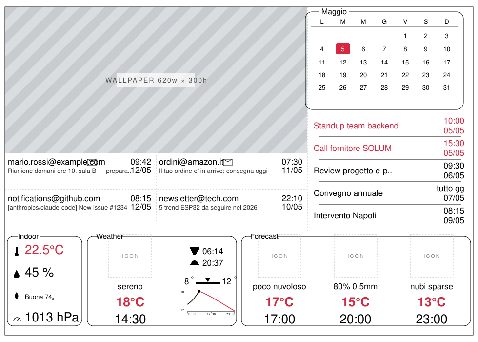

# ePaper SOLUM Dashboard

Firmware Arduino/ESP32 + tool Python per pilotare display e-paper a colori
tramite la libreria [GxEPD2](https://github.com/ZinggJM/GxEPD2) di
Jean-Marc Zingg. Il repository supporta due pannelli SOLUM con la stessa
logica applicativa, selezionabili a compile-time via
`#define DISPLAY_VARIANT_*` (vedi
[Selezione del display](#selezione-del-display)):

- **SOLUM ESL 9.7"** (672w × 960h nativo → 960w × 672h landscape, controller
  SSD1677) — driver in uso e verificato su B/N/R.
- **SOLUM 12.2"** (960w × 768h, **due controller SSD16xx** da 960 × 384
  ciascuno) — una banda stampa, le due insieme no.

Entrambi i driver stanno nel submodule
[`GxEPD2_SOLUM_ESL/`](GxEPD2_SOLUM_ESL), che è una libreria Arduino a sè
stante.

> **Convenzione dimensioni in questo README**: `NwxMh` (o `Nw × Mh`) significa
> `N` pixel in larghezza (asse X) e `M` pixel in altezza (asse Y). Le
> coordinate sono sempre `(x, y)` con origine in alto a sinistra del pannello
> orientato landscape (dopo `setRotation(0)`). Quando una stringa è il nome
> di un identificatore di codice (es. `GxEPD2_SOLUM_097c_960x672`), invece,
> i numeri restano nel formato originale del simbolo e non vanno reinterpretati.

Il driver custom (header-only) per il SOLUM 9.7" aggiunge:

- una **API `showImage()` unificata** come unico entry-point one-shot di
  stampa immagine, con hibernate automatico opzionale. Due overload:
  descrittore generico (output dello script Python) e bitmap raw 1bpp
  B/N (formato [image2cpp](https://javl.github.io/image2cpp/));
- **3 API siblings uniformi** `writeImageBlack` / `writeImageRed` /
  `writeImageYellow` per scrittura single-channel, usate nel flusso
  paged con yellow iniettato "out-of-band" (vedi [sezione dedicata](GxEPD2_SOLUM_ESL/README.md#3-perchè-il-yellow-è-out-of-band-nel-flusso-paged));
- un **sistema di descrittori universale** (`GxEPDImage::Descriptor`) che
  porta con sè formato e dimensioni dell'immagine (BW / BWR / BWRY);
- **API per il 4° colore** (giallo) sul comando `0x28` del controller
  SSD1677. Sul pannello però il giallo non compare: che `0x28` sia il piano
  giallo è un assunto non confermato, vedi
  [§0.10 del README del driver](GxEPD2_SOLUM_ESL/README.md#010-il-4-colore-non-appare-questione-aperta).

Lo sketch principale compone uno schermo completo con:

- **background cinema scaricato via HTTP** dalla webapp
  [`webapp/`](webapp/) (collage locandine + orari del prossimo martedì);
  fetch una tantum al primo boot con WiFi su, immagine tenuta in RAM/PSRAM
  per tutti i refresh successivi. Se il fetch fallisce o il WiFi non c'è
  si usa il fallback PROGMEM [`wallpaper/img_apple_bwry.h`](wallpaper/img_apple_bwry.h).
  Vedi [Background cinema](#background-cinema);
- **banner meteo** in basso, 3 riquadri in stile "fieldset" (titolo sul
  bordo): **Indoor** (BME680, 1 colonna × 4 righe: T/RH/IAQ/pressione),
  **Weather** (meteo corrente OWM + sub-colonna sun a destra:
  alba/tramonto + 2 placeholder), **Forecast** (3 previsioni OWM);
- **calendario** del mese corrente in alto a destra, bordi arrotondati
  in stile fieldset (nome del mese sul bordo superiore) e data odierna
  in rosso pieno (`fillRoundRect`);
- **lista eventi** (5 slot) sotto al calendario, fusione di **Outlook**
  (Microsoft Graph) e **Google Calendar** ordinati per inizio: gli
  eventi di oggi sono colorati in rosso, gli altri in nero, con evento
  in corso (end nel futuro) mantenuto fino al termine effettivo;
- **griglia mail Gmail** sotto al wallpaper: 4 mail su 097c (2×2) / 6 su
  122c (2×3). Per cella: indirizzo email del mittente + badge busta inline
  se la mail è non letta, oggetto subito sotto, orario `HH:MM` e data
  `dd/MM` impilati a destra (come per gli eventi calendario). Solo nero,
  font come gli eventi calendario. Vedi [Mail (`Mail.h`)](#mail-mailh);
- **localizzazione Europe/Rome** con **DST automatico** (POSIX TZ
  impostato da `Calendar::initTimezone()` in `setup()`);
- **finestra di manutenzione** al boot (default 3 min): aggiornamento del
  firmware e configurazione dei tempi da browser, sulla rete di casa, con
  access point di riserva se la STA non sale.

Il convertitore Python con GUI permette di produrre in modo rapido tutti
i formati supportati (B/N, BWR, BWRY), con preset dimensionali per SOLUM
672w × 960h e GDEY0420F51 400w × 300h e anteprima automatica che si aggiorna ad
ogni modifica dei parametri.

---

## Indice

- [Hardware supportato](#hardware-supportato)
- [Struttura del repository](#struttura-del-repository)
- [Selezione del display](#selezione-del-display)
  - [Font utilizzati](#font-utilizzati)
- [Configurazione (Env.h)](#configurazione-envh)
- [Driver custom GxEPD2_SOLUM_097c_960x672](#driver-custom-gxepd2_solum_097c_960x672) (→ [doc dedicata](GxEPD2_SOLUM_ESL/README.md))
- [Moduli applicativi](#moduli-applicativi)
- [Sketch principale](#sketch-principale)
- [Flussi di boot e timeout](#flussi-di-boot-e-timeout)
- [Background cinema](#background-cinema)
- [Rate limit API esterne](#rate-limit-api-esterne)
- [Convertitore immagini Python](#convertitore-immagini-python)
- [Build e flash](#build-e-flash)
- [Crediti](#crediti)
- [Licenza](#licenza)

---

## Hardware supportato

| Pannello | Risoluzione (landscape) | Colori | Controller | Note |
|----------|------------|--------|------------|------|
| **SOLUM ESL 9.7"** | 960w × 672h | B/N + rosso verificati; **4° colore da verificare** | SSD1677 | Driver custom incluso come submodule (`GxEPD2_SOLUM_ESL/`). Il giallo scritto sul comando `0x28` non compare sul pannello; il code point ancora inesplorato è `(0x24 = 0, 0x26 = 1)` ([questione aperta](GxEPD2_SOLUM_ESL/README.md#010-il-4-colore-non-appare-questione-aperta)). Selezione: `#define DISPLAY_VARIANT_097C` |
| **SOLUM 12.2"** | 960w × 768h | B/N + rosso (serigrafia sul vetro) | **2 × SSD16xx**, 960 × 384 ciascuno | Driver nel submodule (`GxEPD2_SOLUM_ESL/src/GxEPD2_SOLUM_122c_960x768.h`), **una banda validata, le due insieme no**: resta aperto come si indirizzi il secondo controller ([README_122c.md](GxEPD2_SOLUM_ESL/README_122c.md)). Stessa logica applicativa via `Layout_122c.h`. Selezione: `#define DISPLAY_VARIANT_122C` |
| Good Display **GDEY0420F51** | 400w × 300h | B/N + rosso + giallo (nativi) | HX8717 | Supportato via `GxEPD2_4C` upstream; nel convertitore è disponibile il preset dimensionale 400w × 300h (no firmware completo) |

Scheda di pilotaggio di riferimento: **Waveshare E-Paper ESP32 Driver Board**.
La piedinatura del bus HSPI (`SCK=13, MISO=12, MOSI=14, SS=15`) è
board-specific e vive nel `.ino` (`hspi.begin(...)`). I pin del driver
display (`CS=15, DC=27, RST=26, BUSY=25`) sono display-specific e vivono
in `Layout::PIN_*` (uguali per le due varianti SOLUM, su questa board).

---

## Struttura del repository

```
.
├── GxEPD2_SOLUM_ESL/               # Submodule: libreria Arduino dei driver SOLUM (9.7" 672w x 960h native portrait, 12.2" 768w x 960h)
│   ├── src/                            # Header-only
│   │   └── GxEPD2_SOLUM_097c_960x672.h # Classe + namespace GxEPDImage
│   ├── examples/097c/panel_diagnostic/ # Diagnostica del pannello: solo SPI.h, nessuna libreria
│   ├── docs/                           # Cataloghi SOLUM + schematico Waveshare V3 (PDF)
│   ├── library.properties              # name=GxEPD2_SOLUM_ESL, depends=GxEPD2 (>=1.6.9)
│   ├── LICENSE                         # GPL-3.0, ereditata da GxEPD2
│   ├── README.md                       # Documentazione dedicata del driver
│   ├── drawImage_overloads.md          # Lista signature drawImage* (EN)
│   └── drawImage_overloads_it.md       # Idem in italiano
├── ePaper-weather-dashboard.ino    # Sketch principale: tabella dei task + adattatori verso i moduli
├── Timings.h                       # Tutti i tempi: default, pavimenti, override runtime su NVS
├── Scheduler.h                     # Scheduler dei flussi temporizzati + light sleep dinamico
├── Log.h                           # Macro LOG/LOGV con tag e livello di verbosita'
├── Layout.h                        # Dispatcher: include Layout_097c.h o Layout_122c.h via #define DISPLAY_VARIANT_*
├── Layout_097c.h                   # Coordinate / pin / font / Panel typedef per SOLUM 9.7" (960w x 672h)
├── Layout_122c.h                   # Coordinate / pin / font / Panel typedef per SOLUM 12.2" (960w x 768h)
├── Env.h                           # Segreti (WiFi, OWM, manutenzione, OAuth) + posizione GPS
├── Weather.h                       # Fetch OWM + rendering banner meteo (4 blocchi)
├── Calendar.h                      # Mese + lista eventi Outlook+Google + TZ Europe/Rome
├── Mail.h                          # Lettura ultime N mail Gmail via batch endpoint + UI griglia 2×2 / 2×3
├── Indoor.h                        # Sensore BME680 via I2C (BSEC2 ULP, IAQ+T+RH, persistenza NVS)
├── Maintenance.h                   # Finestra di manutenzione: /update + /config, su rete di casa con AP di riserva
├── Graphics.h                      # Utility di disegno condivise (drawFieldsetRect)
├── icons.h                         # Bitmap icone meteo indicizzate per icon code OWM
├── preview_097c.html               # Anteprima statica HTML del layout SOLUM 9.7" (960w x 672h)
├── preview_122c.html               # Idem per il SOLUM 12.2" (960w x 768h)
├── preview.svg                     # Anteprima del layout 097c renderizzata da GitHub nel README
├── epd_image_converter.pyw         # Convertitore GUI Python -> array .h
├── test/                           # Test su host della logica di Timings.h e Scheduler.h (./test/esegui.sh)
├── wallpaper/
│   └── img_apple_bwry.h            # Fallback wallpaper 4-colori (offline) + descrittore
├── webapp/                         # Webapp FastAPI cinema (vedi webapp/README.md)
├── LICENSE
└── README.md
```

---

## Selezione del display

Il firmware supporta due pannelli SOLUM (controller SSD1677, 4 colori
nativi BWRY) con la **stessa logica applicativa**: cambia solo il driver
e il layout grafico (coordinate, baseline, font, dimensioni del wallpaper
cinema). La selezione avviene via `#define` in testa allo sketch,
scommentando UNA sola delle due varianti:

```cpp
// In ePaper-weather-dashboard.ino:
#define DISPLAY_VARIANT_097C
//#define DISPLAY_VARIANT_122C
```

| Variante                | Pannello             | Risoluzione | File layout       |
|-------------------------|----------------------|-------------|-------------------|
| `DISPLAY_VARIANT_097C`  | SOLUM ESL 9.7"       | 960w × 672h | [Layout_097c.h](Layout_097c.h) |
| `DISPLAY_VARIANT_122C`  | SOLUM 12.2"          | 960w × 768h | [Layout_122c.h](Layout_122c.h) |

### Cosa contiene un Layout_*.h

Ogni Layout definisce un namespace `Layout` con gli stessi simboli per
entrambe le varianti, in modo che i moduli applicativi
(`Weather.h`, `Calendar.h`, `Graphics.h`, `icons.h`, lo sketch `.ino`) li
referenzino in modo uniforme:

- **`Layout::Panel`** — typedef della classe driver (`GxEPD2_SOLUM_097c_960x672`
  o `GxEPD2_SOLUM_122c_960x768`). Lo sketch istanzia il display come
  `GxEPD2_3C<Layout::Panel, Layout::Panel::HEIGHT/8>`.
- **`Layout::PIN_CS / PIN_DC / PIN_RST / PIN_BUSY`** — pin del driver
  display passati al costruttore `Panel(...)`. Il bus HSPI condiviso
  (SCK/MISO/MOSI = 13/12/14) resta nello sketch.
- **`Layout::ROTATION / SCREEN_W / SCREEN_H`** — orientamento e
  geometria del frame visibile.
- **`Layout::CINEMA_*`** — dimensioni dell'area wallpaper cinema, URL
  del server (la query string riflette `width`/`height` corretti),
  `STRIDE`, `PLANE_SZ`, `TOTAL_SZ` per il fetch HTTP.
- **`Layout::SIDEBAR_*`, `BANNER_*`, `INDOOR_RR_*`, `WEATHER_RR_*`,
  `FORECAST_RR_*`, `BLOCK_*`** — fieldset e blocchi del banner meteo.
- **`Layout::ICON_Y / DESC_BASELINE / TEMP_BASELINE / TIME_BASELINE`** —
  baseline del rendering testo dentro un blocco meteo (relative a
  `BANNER_Y`, così lo scaling 097c→122c si propaga in automatico).
- **`Layout::INDOOR_ROW1..4_BASELINE`, `INDOOR_COL1_OFFSET`,
  `INDOOR_ICON_GAP`** — sub-colonna dati indoor + sub-colonna sun.
- **`Layout::CAL_*` / `EVT_*`** — riquadro mese e area eventi sidebar.
- **`Layout::ICON_SIZE / INDOOR_ICON_SIZE`** — lato delle bitmap icone.
- **`Layout::TRB_*`** — buffer della barra temp-range gialla.
- **`Layout::FONT_LARGE_BOLD / FONT_LARGE / FONT_BODY / FONT_SMALL /
  FONT_MICRO`** — `const GFXfont*` per ciascun ruolo semantico (titoli
  fieldset, orario, descrizione, IAQ, pedice accuracy). Sostituire i
  font in `Layout_122c.h` non richiede modifiche ai moduli.

Il dispatcher [`Layout.h`](Layout.h) valuta le `#define` e include uno
solo dei due `Layout_*.h`; se nessuno (o entrambi) sono definiti emette
`#error` a compile-time.

### Differenze layout 097c vs 122c

Il pannello 12.2" ha la stessa larghezza (960 px) e 96 px in più in
altezza (672→768). I 96 px aggiuntivi sono distribuiti per mantenere il
banner ancorato al fondo schermo:

| Costante           | 097c   | 122c   | Note                                        |
|--------------------|-------:|-------:|---------------------------------------------|
| `SCREEN_H`         | 672    | 768    | +96 px verticale                            |
| `BANNER_Y`         | 460    | 556    | banner ancorato al fondo, +96               |
| `BANNER_H`         | 212    | 212    | invariato (baseline ricalcolate dalla cascata) |
| `CINEMA_H`         | 300    | 335    | +35 sul 122c; il resto dell'extra va in EVT_H + fascia mail |
| Area mail (`MAIL_H`)| 160h   | 221h   | `BANNER_Y - CINEMA_H`. Griglia `MAIL_COLS × MAIL_ROWS_PER_COL` = 2×2 (4 mail) sul 097c, 2×3 (6 mail) sul 122c |
| `EVT_H`            | 230    | 326    | +96 (assorbe extra verticale in sidebar)    |
| `CINEMA_PLANE_SZ`  | 23 400 | 26 130 | (W/8)·H per ogni piano BWRY                 |
| `CINEMA_TOTAL_SZ`  | 70 200 | 78 390 | 3 piani -> ~69 KB (097c) / ~77 KB (122c)    |
| `CINEMA_URL` height| 300    | 335    | il server riceve la dimensione corretta     |

Tutto il banner (`X/W` dei fieldset, `BLOCK_FC*_X`, `SUN_COL_OFFSET`)
resta invariato perchè la larghezza è identica. Le baseline interne
del banner (icona, description, temp, time, indoor row1..4) sono
espresse come `BANNER_Y + offset` in entrambi i Layout, quindi seguono
la traslazione di `BANNER_Y` in automatico. I font sono gli stessi
nelle due varianti per ora: modificare `Layout_122c.h` per scegliere
size diverse è un cambio mirato che non tocca i moduli.

### Font utilizzati

I moduli applicativi non referenziano mai direttamente i font GFX:
usano sempre gli alias semantici `Layout::FONT_*`, definiti in
[`Layout_097c.h`](Layout_097c.h#L60-L78) e
[`Layout_122c.h`](Layout_122c.h#L60-L73). Cambiare un font vuol dire
ridefinire l'alias nel Layout, senza toccare i moduli.

Tutti i font usati appartengono al set Adafruit_GFX (`<Fonts/*.h>`)
tranne `Picopixel` (anch'esso Adafruit_GFX). Sono inclusi una sola
volta dal Layout selezionato.

| Alias semantico        | Font GFX             | Dimensione  | Dove viene usato |
|------------------------|----------------------|-------------|------------------|
| `FONT_MICRO`           | `Picopixel`          | ~3 pt (4×6 px) | Label `HH:MM` dei tick asse X del mini-chart temperatura ([`Weather.h:1017`](Weather.h#L1017)); pedice numerico accuracy IAQ accanto al valore dell'aria interna ([`Weather.h:1127`](Weather.h#L1127)) |
| `FONT_SMALL`           | `FreeSans9pt7b`      | 9 pt        | Oggetto (subject) delle mail nella griglia 2×N ([`Mail.h:626`](Mail.h#L626)); label IAQ (`Buona 74` ecc.) e fallback `--` della riga 3 del riquadro Indoor ([`Weather.h:1117`](Weather.h#L1117), [`Weather.h:1136`](Weather.h#L1136)) |
| `FONT_BODY`            | `FreeSans12pt7b`     | 12 pt       | Header giorni e numeri della griglia del calendario ([`Calendar.h:739`](Calendar.h#L739)); riga eventi (titolo + orario + data) ([`Calendar.h:817`](Calendar.h#L817)); stato `no mail`, indirizzo mittente e formato `HH:MM` / `dd/MM` delle mail ([`Mail.h:562`](Mail.h#L562), [`Mail.h:579`](Mail.h#L579), [`Mail.h:599`](Mail.h#L599)); descrizione meteo corrente ([`Weather.h:529`](Weather.h#L529)); label nere della barra temp-range (cifre `morn`/`eve` + cerchietti °) ([`Weather.h:726`](Weather.h#L726), [`Weather.h:798`](Weather.h#L798)); HH:MM di alba/tramonto ([`Weather.h:1164`](Weather.h#L1164)); titoli dei fieldset `Indoor` / `Weather` / `Forecast` ([`Weather.h:1205`](Weather.h#L1205)) |
| `FONT_LARGE`           | `FreeSans18pt7b`     | 18 pt       | Nome del mese sul bordo del riquadro calendario in stile fieldset ([`Calendar.h:711`](Calendar.h#L711)); valori grandi del riquadro Indoor: temperatura, umidità, pressione ([`Weather.h:1076`](Weather.h#L1076), [`Weather.h:1132`](Weather.h#L1132), [`Weather.h:1138`](Weather.h#L1138)) |
| `FONT_LARGE_BOLD`      | `FreeSansBold18pt7b` | 18 pt bold  | Temperatura percepita "feels-like" dei blocchi meteo corrente + 3 forecast, in rosso ([`Weather.h:538`](Weather.h#L538)) |
| `FONT_TIME` *(alias)*  | `FreeSans18pt7b` (097c) / `FreeSans12pt7b` (122c) | 18 / 12 pt | Orario `HH:MM` sotto i blocchi meteo (current + forecast) ([`Weather.h:556`](Weather.h#L556)). Unico alias che cambia tra i due Layout: sul 12.2" viene rimappato a `FONT_BODY` per uniformare l'aspetto agli orari degli eventi calendario, con shift di +8 px sulle baseline `ICON_Y` / `DESC` / `TEMP` / `TIME` del blocco meteo per ridistribuire lo spazio verticale liberato ([`Layout_122c.h:161-164`](Layout_122c.h#L161-L164)) |

Note pratiche:

- Tutti i font `*7b` (FreeSans*) **non** contengono il glifo `°`: il
  simbolo dei gradi è disegnato come cerchietto da `drawTempWithDegree`,
  con raggio differenziato tra Regular (2 px) e Bold (3 px).
- `Picopixel` rende grossolanamente ai piccoli formati: l'accuracy IAQ
  viene shiftata di +2 px (`setCursor(subX, baseline + 2)`) per
  apparire come pedice rispetto al numero IAQ in `FONT_SMALL`.
- Le label gialle e nere della barra temp-range usano entrambe
  `FONT_BODY` (cambio recente da 9pt a 12pt, vedi
  [`Weather.h:725`](Weather.h#L725)).

### Aggiungere un terzo display

1. Scrivere il driver custom (cartella + `.h` header-only sullo schema
   di [`GxEPD2_SOLUM_ESL/`](GxEPD2_SOLUM_ESL/)).
2. Creare `Layout_<nome>.h` con gli stessi simboli del namespace
   `Layout` (Panel, pin, font, coord, cinema).
3. Aggiungere il ramo `#elif defined(DISPLAY_VARIANT_<NOME>)` in
   [Layout.h](Layout.h).
4. Nello sketch `.ino` aggiungere `#define DISPLAY_VARIANT_<NOME>` in
   alternativa ai due esistenti.

I moduli applicativi non vanno toccati.

---

## Configurazione (Env.h)

`Env.h` raccoglie i **segreti** (credenziali WiFi, API key
OpenWeatherMap, password dell'AP OTA, client-secret e refresh-token
OAuth) e la **posizione GPS** (dato personale, accoppiato alla chiave
OWM). Le costanti di dominio non-sensibili stanno nei moduli consumer:
`CAL_POSIX_TZ` (Europe/Rome con DST automatico) e
`CAL_MSGRAPH_TENANT_ID` in `Calendar.h`.

```cpp
#ifndef ENV_H
#define ENV_H

/* --- Rete WiFi di casa (STA) --- */
#define WIFI_SSID       "my_network"
#define WIFI_PASSWORD   "my_password"

/* --- OpenWeatherMap --- */
#define OWM_API_KEY     "my_api_key"
#define LAT             41.9028f    /* Roma */
#define LON             12.4964f

/* --- Access Point esposto al boot per l'OTA (WPA2 min 8 char) --- */
#define OTA_AP_SSID     "ePaper-OTA"
#define OTA_AP_PASSWORD "change_me_min8"

/* --- Microsoft Graph (Outlook) --- */
#define MSGRAPH_CLIENT_ID     "00000000-0000-0000-0000-000000000000"
#define MSGRAPH_REFRESH_TOKEN "paste_refresh_token_here"

/* --- Google Calendar API v3 --- */
#define GOOGLE_CLIENT_ID      "xxxx-yyyy.apps.googleusercontent.com"
#define GOOGLE_CLIENT_SECRET  "paste_client_secret_here"
#define GOOGLE_REFRESH_TOKEN  "paste_refresh_token_here"

#endif
```

| Define                  | Obbligatorio | Note                                                   |
|-------------------------|:-:|-------------------------------------------------------------------|
| `WIFI_SSID`             | si | SSID della rete di casa (STA).                                   |
| `WIFI_PASSWORD`         | si | Password WPA/WPA2 della rete di casa.                            |
| `OWM_API_KEY`           | si | API key gratuita OpenWeatherMap.                                 |
| `LAT` / `LON`           | si | Latitudine e longitudine (float) per la query meteo.             |
| `OTA_AP_SSID`           | si | SSID esposto dal device al boot per l'OTA.                       |
| `OTA_AP_PASSWORD`       | si | Minimo 8 caratteri (limite WPA2). Unico gate sulla `/update`.    |
| `MSGRAPH_CLIENT_ID`     | opz | Client pubblico Azure AD con scope `Calendars.Read offline_access`. Omettere tutti e due i MSGRAPH_* se non si usa Outlook. |
| `MSGRAPH_REFRESH_TOKEN` | opz | Refresh token ottenuto da PC via MSAL.                          |
| `GOOGLE_CLIENT_ID`      | opz | Client OAuth "Desktop app" da Google Cloud Console. Omettere tutti e tre i GOOGLE_* se non si usa nè Google Calendar nè Gmail. |
| `GOOGLE_CLIENT_SECRET`  | opz | Client secret della stessa app.                                 |
| `GOOGLE_REFRESH_TOKEN`  | opz | Refresh token con scope `calendar.readonly` **e/o** `gmail.readonly` (vedi sotto). |

> ℹ️ **Refresh token Google condiviso fra Calendar e Mail**. `Mail.h` riusa
> `GOOGLE_CLIENT_ID`, `GOOGLE_CLIENT_SECRET` e `GOOGLE_REFRESH_TOKEN`: se
> abiliti entrambi i moduli (Calendar Google + Mail), il refresh_token deve
> essere stato emesso con **scope unificati** `calendar.readonly` +
> `gmail.readonly`. Per aggiungere il modulo Mail a un progetto che già
> usa il Calendar: ri-esegui il flusso OAuth (con `prompt=consent`)
> chiedendo entrambi gli scope, sostituisci `GOOGLE_REFRESH_TOKEN` con il
> nuovo valore e abilita la **Gmail API** sullo stesso progetto Cloud.

I parametri **non-sensibili e non-accoppiati ai segreti** (fuso orario,
tenant Azure pubblico) non stanno in `Env.h` ma nei moduli consumer:
`CAL_POSIX_TZ` e `CAL_MSGRAPH_TENANT_ID` in `Calendar.h`. Allo stesso
modo la configurazione hardware del BME680 (`BME680_I2C_ADDR`,
`BME680_SDA_PIN`, `BME680_SCL_PIN`) vive in [`Indoor.h`](Indoor.h): sono
costanti locali al modulo, non segreti.

> ⚠️ **Non committare `Env.h`** dopo averlo editato. Tenerlo locale e
> considerare l'uso di una copia `Env.example.h` di riferimento.

---

## Driver custom GxEPD2_SOLUM_097c_960x672

Il driver è **header-only** (`inline` nell'`.h`, nessuna `.cpp`) e nasce
come fork di
[`GxEPD2_1330c_GDEM133Z91`](https://github.com/ZinggJM/GxEPD2/blob/master/src/epd3c/GxEPD2_1330c_GDEM133Z91.cpp)
(pannello Good Display 13.3" 3-colori, stesso controller SSD1677).
Implementa la sequenza di comandi specifica del SOLUM 9.7" e introduce
**4 estensioni** rispetto ai driver stock di GxEPD2:

1. **`GxEPDImage::showImage()`** — unica funzione pubblica per stampare
   un'immagine, supporta BW / BWR / BWRY con yellow gestito internamente.
2. **API single-channel** `writeImageBlack` / `writeImageRed` /
   `writeImageYellow` per scrittura diretta sul controller.
3. **Pattern "yellow out-of-band"** — il giallo (`0x28`) viene iniettato
   prima del loop paged e protetto via `preserveYellow(true)`, perchè il
   template upstream `GxEPD2_3C` ha un'architettura hard-coded a 2 canali.
   Sul pannello quelle scritture per ora non producono giallo:
   [questione aperta](GxEPD2_SOLUM_ESL/README.md#010-il-4-colore-non-appare-questione-aperta).
4. **Sistema di descrittori universali** (`GxEPDImage::Descriptor`) con
   formato + dimensioni dell'immagine (BW / BWR / BWRY).

Lista completa di tutto: motivazione, API, esempi d'uso (7 casi), pitfall
sul `drawPixel(GxEPD_YELLOW)`, ottimizzazioni rispetto al driver stock
(tabella 14 righe + dettaglio bullet), tracking della page corrente
parallelo a `_current_page` privato del template, in:

> 📘 **[GxEPD2_SOLUM_ESL/README.md](GxEPD2_SOLUM_ESL/README.md)** — documentazione dedicata del driver custom,
> che vive nel repo [GxEPD2_SOLUM_ESL](https://github.com/alesimattia/GxEPD2_SOLUM_ESL) come libreria Arduino
> a sè: dopo il clone serve `git submodule update --init --recursive`.

---

## Moduli applicativi

Oltre al driver e al convertitore, lo sketch si appoggia a cinque
moduli applicativi disaccoppiati, ciascuno **header-only**. Il `.ino`
ne **orchestra** solo il ciclo di vita; tutta la logica (stato,
helper, API pubblica) sta dentro il singolo header del modulo,
racchiusa in un sotto-namespace `detail` per non inquinare lo scope
esterno.

### Weather (`Weather.h`)

Scheduler + fetch OpenWeather One Call 3.0 + rendering del banner meteo.

- Endpoint unico: `/data/3.0/onecall` con `exclude=minutely,alerts`,
  `lang=it` e `units=metric`. Una singola chiamata restituisce `current`
  (→ `slots[0]`), `hourly[3/6/9]` (→ `slots[1..3]`, step 3h) e `daily[0]`
  (campi morn/eve memorizzati per uso futuro). In deserializzazione viene
  applicato un `DeserializationOption::Filter` che tiene in memoria solo
  i campi effettivamente letti.
- Campi extra memorizzati ma non ancora visualizzati: `current.sunrise`,
  `current.sunset`, `hourly[].pop`, `hourly[].rain.1h` (mm previsti per l'ora,
  sorgente unica per `slots[0..3].rain1h`),
  `daily[0].feels_like.morn/eve`.
- Intervallo configurabile tramite `#define` in testa allo sketch `.ino`:
  `WEATHER_FORECAST_FETCH_MIN` (default 10 min) pilota l'unica chiamata
  One Call (corrente + previsioni in una sola richiesta).
- **Prerequisito account**: la chiave `OWM_API_KEY` deve essere abilitata
  al piano "One Call by Call" (gratuito fino a 1000 chiamate/giorno, ma
  richiede carta di credito in registrazione). In caso contrario l'endpoint
  risponde `401`/`429`.
- Il WiFi non è gestito qui: `runFetch()` presuppone STA già connessa
  (lo sketch `.ino` si occupa di `wifiOn()`/`wifiOff()` intorno alla
  chiamata, così la radio resta spenta tra un fetch e l'altro).
- Layout banner: fascia 960w × 212h px in basso con 3 riquadri fieldset
  (raggio 18 px, titolo sul bordo superiore): **Indoor** 154w × 202h (1
  colonna × 4 righe centrate verticalmente, icone 20w × 20h:
  T/RH/IAQ/pressione BME680), **Weather** 306w × 202h (a sinistra blocco
  meteo corrente con icona 88w × 88h, descrizione, temperatura percepita
  in rosso, orario; a destra sub-colonna sun con sunrise/sunset,
  **barra gialla temp-range** morn↔eve con indicatore triangolare su
  current.feels_like, e 1 riga riservata), **Forecast** 470w × 202h (3
  slot da ~156w px, stessa anatomia del blocco corrente). La barra
  temp-range ha linea orizzontale gialla (4 px spessa) + triangolo
  indicatore giallo renderizzati via `writeImageYellow` +
  `preserveYellow(true)` del driver custom, chiamati *prima* del loop
  paged perchè il canale 0x28 è out-of-band rispetto al template
  `GxEPD2_3C` (il giallo per ora non compare sul pannello, vedi
  [§0.10 del driver](GxEPD2_SOLUM_ESL/README.md#010-il-4-colore-non-appare-questione-aperta));
  cifre e cerchietti ° di morn/eve sono in **nero**,
  disegnati normalmente nel paged. La barra è centrata orizzontalmente
  rispetto alla riga sunset sovrastante. Utility condivisa
  `Graphics::drawFieldsetRect` in [`Graphics.h`](Graphics.h).
- `Weather::render()` compone il frame completo dentro un loop paged
  `firstPage()`/`nextPage()`: `fillScreen(WHITE)` → `drawBackground()`
  → sidebar placeholder → `Calendar::draw()` → `drawBanner()`.
- **Gate del primo refresh** — `render()` blocca il primo refresh finchè
  `slots[0]` (meteo corrente) e `slots[1]` (prima previsione) non sono
  entrambi validi. Quel gate ora è dello scheduler: il task `display` è
  dovuto solo quando la rete ha prodotto un esito qualsiasi, anche un
  fallimento, oppure sono passati `PRIMO_FRAME_ATTESA_MS` dal boot. Così il
  primo frame arriva sempre, con i dati veri se ci sono e con i placeholder
  `--` altrimenti.

### Calendar (`Calendar.h`)

Modulo calendario, più ricco del nome: comprende widget del mese,
**lista eventi Outlook+Google** e la configurazione **timezone
Europe/Rome con DST automatico**.

**Widget mese** — riquadro 320w × 200h in alto a destra, bordi arrotondati
in stile fieldset (raggio 14 px): il nome del mese in italiano è
disegnato sul bordo superiore interrotto tramite
`Graphics::drawFieldsetRect` ([`Graphics.h`](Graphics.h)). Griglia 7×6
(7 colonne × 6 righe) **Lunedì-first**, cella odierna riempita di rosso
con bordi arrotondati (`fillRoundRect`) e numero in bianco.

**Lista eventi** — 5 righe 300w × 50h sotto al widget mese. Cache separate
per sorgente (`outlookEvents[5]` + `googleEvents[5]`); al rendering le
due cache sono fuse, ordinate per `startUtc` crescente e ritagliate ai
primi 5 eventi più vicini all'orario attuale. Per ogni riga: titolo a
sinistra (troncato se lungo) + data su due righe a destra (data sopra,
orario sotto). Riga rossa se l'evento cade nella data odierna locale,
nera altrimenti.

**Sottosistemi di fetch** — `Calendar::Outlook` e `Calendar::Google`,
namespace gemelli con la stessa API (`begin/runFetch`), ognuno un task
distinto dello scheduler con la propria cadenza (`outl_min` / `goog_min`,
default 10 min). Entrambi usano il flusso OAuth2 **refresh
token**: le credenziali vivono in `Env.h` (`MSGRAPH_*` e `GOOGLE_*`);
il `TENANT_ID` Microsoft è in `Calendar.h` come `CAL_MSGRAPH_TENANT_ID`
(non è un segreto). Gli endpoint sono rispettivamente
`graph.microsoft.com/v1.0/me/events?$filter=end/dateTime ge <now>` e
`googleapis.com/calendar/v3/calendars/primary/events?timeMin=<now>`:
in entrambi i casi un evento in corso (iniziato ma non ancora finito)
resta in lista finchè non termina.

**Timezone** — `Calendar::initTimezone()` applica la stringa POSIX
`CAL_POSIX_TZ = "CET-1CEST,M3.5.0,M10.5.0/3"` al processo via
`setenv + tzset`. Da quel momento ogni `localtime_r()` nel progetto
gestisce automaticamente la transizione CET↔CEST. `Calendar::draw()`
accetta solo un `utcEpoch`: il fuso non è più un parametro.

Non dipende dalla rete per il disegno: se il fetch fallisce o non è mai
stato fatto, la lista mostra 5 placeholder `--`. L'epoch di riferimento
per "oggi" arriva da `Weather::slots[0].epoch` (fallback a
`time(nullptr)`).

### Mail (`Mail.h`)

Modulo di lettura delle ultime mail della propria casella Gmail con
**UI a griglia** sotto al wallpaper cinema (4 mail su 097c in 2×2, 6 su
122c in 2×3). Solo nero, font come gli eventi calendario.

**API pubblica**

| Funzione | Effetto |
|---|---|
| `Mail::begin()` | Azzera la cache. Una tantum in `setup()`. |
| `Mail::runFetch()` | Esegue il fetch (best-effort). Ritorna `true` se la cache è aggiornata; lo scheduler ne fa seguire il ridisegno. Cadenza e ritenti non sono suoi. |
| `Mail::draw()` | Disegna la griglia mail nell'area `Layout::MAIL_*`. Chiamato da `Weather::renderFrame()` nel paged loop, tra `Calendar::draw` e `drawBanner`. |
| `Mail::count()` | Numero di mail attualmente in cache (0..`Layout::MAIL_MAX`). |
| `Mail::at(i)` | Slot `i` della cache (`MailMessage`: `sender`, `subject`, `receivedUtc`, `unread`). |

**Anatomia della cella** — speculare alle entry calendario:

- *Sinistra alto*: indirizzo email del mittente (FONT_BODY). Il `From`
  Gmail viene parsato e ridotto al solo `<email>` (eventuale nome scartato).
- *Sinistra alto, accanto al mittente*: icona busta 20×20 compressa
  (rettangolo interno 18w × 14h) — disegnata SOLO se `m.unread == true`,
  come badge "non letto". Troncamento del mittente lascia spazio
  all'icona quando presente.
- *Sinistra basso (ravvicinato)*: oggetto (FONT_SMALL), troncato.
- *Destra alto*: orario `HH:MM` (FONT_BODY, allineato a destra).
- *Destra basso*: data `dd/MM` (FONT_BODY, allineato a destra).

Cella senza mail in cache → placeholder `--` in alto a sinistra.

**Coordinate area** (per variante):

| Variante | `MAIL_X/Y/W/H`   | Griglia       | `MAIL_COL_W` × `MAIL_ROW_H` | `TOP_PAD` / `ROW_GAP` / `BOT_PAD` |
|----------|------------------|---------------|-----------------------------|-----------------------------------|
| 097c     | 0, 300, 620, 160 | 2 × 2 = 4 mail | 310 × 63                    | 4 / 12 / 18                       |
| 122c     | 0, 335, 620, 221 | 2 × 3 = 6 mail | 310 × 58                    | 5 / 12 / 18                       |

`MAIL_ROW_GAP` separa visivamente le entry; `MAIL_BOT_PAD` stacca
l'ultima riga dal banner meteo sottostante.

**Flusso di un fetch (1 GET + 1 POST batch, 2 handshake TLS totali)**

1. **Refresh token** condiviso con `Calendar::Google` — `Mail.h` non
   mantiene una propria cache di access_token: invoca direttamente
   `Calendar::detail::refreshGoogleToken()` e legge
   `Calendar::detail::cachedGoogleToken`. Una sola POST al token endpoint
   per ciclo (anche con entrambi i moduli attivi).
2. **List `messages.list`** —
   `GET /gmail/v1/users/me/messages?maxResults=N&labelIds=INBOX&fields=messages(id)`.
   Il `fields=` filter riduce la risposta a ~150 byte; un `DeserializationOption::Filter`
   ArduinoJson scarta in fase di parse i campi non richiesti.
3. **Batch `messages.get`** — UNA POST `multipart/mixed` verso
   `https://gmail.googleapis.com/batch/gmail/v1` con N sub-request:
   `format=metadata&metadataHeaders=From,Subject,Date&fields=internalDate,labelIds,payload/headers(name,value)`.
   Sostituisce N GET separate con un singolo handshake TLS. Il `Bearer`
   token va solo nell'header esterno: il batch endpoint lo propaga alle
   sub-request.
4. **Parsing multipart** in streaming: helper `extractBoundary()` +
   split sul boundary; ogni JSON sub-response viene deserializzato con
   filter (`internalDate`, `labelIds`, `payload.headers[name,value]`).
   Una sub-response 4xx/5xx singola non blocca le altre (best-effort).
5. **Cache aggiornata** con un commit atomico dal buffer temporaneo, più
   il log di riepilogo delle mail.

**Cosa viene memorizzato per ogni mail** (struct `Mail::MailMessage`):
- `sender` (max 64 char) — header `From` parsato: solo l'indirizzo email
  fra `<` e `>` (l'eventuale nome leggibile viene scartato), oppure il
  valore nudo se il `From` non contiene `< >`. Troncato a `MAIL_SENDER_LEN-1`.
- `subject` (max **60 char**) — header `Subject` troncato.
- `receivedUtc` — `internalDate` Gmail (timestamp UTC autoritativo del
  server, **non** l'header `Date` che può essere falso/vuoto).
- `unread` — `true` se `labelIds` contiene `UNREAD`.
- `valid` — slot popolato.

**Configurazione (in `Mail.h`, override-abile dal `.ino`)**

| `#define` | Default | Effetto |
|---|---|---|
| `MAIL_GOOGLE_FETCH_MIN` | `15` | Cadenza fetch in minuti, **indipendente** da `CAL_GOOGLE_FETCH_MIN`. Il `.ino` la imposta a `10` per allinearla ai calendari. |
| `MAIL_MAX_MESSAGES` | `Layout::MAIL_MAX` (4 097c / 6 122c) | Numero massimo di mail da scaricare/cachare. Default agganciato al layout grafico per avere esattamente tante mail quante celle visibili. |
| `MAIL_ONLY_UNREAD` | `0` | `1` per filtrare solo non lette (`labelIds=INBOX&labelIds=UNREAD`, AND lato Gmail). |
| `MAIL_GMAIL_HOST` | `https://gmail.googleapis.com` | Host base API. |
| `MAIL_GMAIL_BATCH_URL` | `https://gmail.googleapis.com/batch/gmail/v1` | Endpoint batch multipart. |
| `MAIL_GMAIL_SCOPE` | `gmail.readonly` (URL-encoded) | Scope OAuth richiesto. |
| `MAIL_SENDER_LEN` | `64` | Lunghezza buffer mittente. |
| `MAIL_SUBJECT_LEN` | `60` | Lunghezza buffer oggetto. |
| `MAIL_FETCH_BUDGET_MS` | `10000` | Wall-clock budget end-to-end di `runFetch()`. Oltre la soglia interrompe la fase metadata e lascia in cache le mail già parseate (cache parziale, non è un errore). Evita che un fetch mail patologicamente lento eroda il tempo dei fetch calendario successivi. |

**Resilienza** — `Mail::runFetch()` è best-effort: se WiFi cade durante
il fetch, se l'inbox è vuota, se il batch HTTP risponde con errore o
se il budget scade, il flusso software del `.ino` **prosegue normalmente**
con i fetch calendario successivi. Il backoff è dello scheduler
(`FETCH_MAX_TENTATIVI=2`, ritento a 30 s), e serve a evitare l'hammering
del token endpoint durante la finestra di manutenzione, dove il loop gira a
10 ms: dopo 2 tentativi consecutivi falliti si posticipa il
prossimo retry di `MAIL_GOOGLE_FETCH_MIN` minuti.

Garanzie complete di `Mail::runFetch()` per ogni scenario di failure:

Il ritento non è di Mail: `runFetch()` dice solo com'è andata, e lo
scheduler decide (30 s, poi la cadenza piena dopo due fallimenti).

| Scenario | Ritorno | Cache |
|---|---|---|
| WiFi giù | Non viene nemmeno chiamata: lo scheduler pre-controlla la radio e segna `saltato`, **senza spendere il tentativo** | Preservata |
| Token refresh fallito (rete / auth) | `false` | Preservata |
| Budget `MAIL_FETCH_BUDGET_MS` esaurito | `false` | Preservata |
| `messages.list` HTTP 4xx/5xx/timeout | `false` | Preservata |
| `messages.list` HTTP 401 | `false`, più il reset di `cachedGoogleToken`: il refresh si ripara da solo al ciclo dopo | Preservata |
| `messages.list` ritorna 0 mail (inbox vuota) | `true` | **Azzerata**: è una risposta valida, non un errore |
| `messages.batch` failure / timeout / boundary mancante | `false` | **Preservata** (tmp scartato) |
| `messages.batch` HTTP 200 ma 0 parsati (API cambiata) | `false` | **Preservata** (guardia contro il wipe) |
| `messages.batch` HTTP 200 con M<N parsati | `true` | Aggiornata con M mail |
| Tutto OK | `true` | Aggiornata con N mail |

Nessun percorso può propagare un'eccezione o bloccare il `.ino`:
`runFetch()` ritorna sempre, sempre rapidamente (entro
`MAIL_FETCH_BUDGET_MS = 10 s`), e il chiamante ignora il return value.
La cache esistente viene riscritta SOLO su fetch end-to-end riuscito
(commit atomico via buffer temporaneo): su fallimento transitorio
l'ultimo snapshot valido resta visibile alla futura UI.

**Setup OAuth (una tantum)** — vedi tabella `Env.h` sopra. Il modulo
non aggiunge **nessun nuovo segreto**: riusa `GOOGLE_CLIENT_ID`,
`GOOGLE_CLIENT_SECRET`, `GOOGLE_REFRESH_TOKEN`. Il refresh_token deve
però essere stato emesso con scope `calendar.readonly` **+**
`gmail.readonly` (consent unificato).

### Indoor (`Indoor.h`)

Lettura sensore ambientale **Bosch BME680** via I2C + fusione IAQ con
libreria **Bosch BSEC2** in modalità **ULP** (un sample ogni 5 min,
combacia col light sleep del ciclo main e con la rotazione
dell'immagine di background). Nessuna UI in questa fase: il modulo
espone solo una cache (`Indoor::sample()`) con temperatura e umidità
heat-compensated, pressione (hPa), indice IAQ (0-500) e livello di
calibrazione (0-3).

`Indoor::refresh()` va chiamato ad ogni giro di `loop()`: BSEC
temporizza internamente i 5 min. Quando un nuovo campione arriva la
funzione ritorna `true` e lo sketch risponde con `Weather::markDirty()`
per innescare il refresh del display anche in assenza di fetch di rete.

**Persistenza stato BSEC** — lo stato del calibratore viene salvato
su NVS (namespace `bme680`, chiave `state`) ogni 6 ore, e solo quando
l'accuratezza ha raggiunto almeno 1 (per non sovrascrivere uno stato
buono con uno transitorio). Al boot lo stato viene ricaricato con
`bsec.setState()` prima di sottoscrivere gli output: dal secondo avvio
in poi l'IAQ è disponibile quasi subito, evitando il warm-up 5-30 min
tipico dopo un power cycle.

**Config hardware** (`BME680_I2C_ADDR`, `BME680_SDA_PIN`,
`BME680_SCL_PIN`) in [`Indoor.h`](Indoor.h) — default 0x77 / SDA 21 /
SCL 22.

Se il sensore non è collegato o l'indirizzo è errato `begin()` logga
`[BME680] init failed` e il modulo si comporta come un no-op: meteo,
calendario e display continuano a girare normalmente.

### Maintenance (`Maintenance.h`)

Finestra di manutenzione di **default 3 minuti** al boot (durata
configurabile, `MAINT_WINDOW_MIN`): un `WebServer` con `HTTPUpdateServer`
su `/update` per l'aggiornamento del firmware, e una pagina `/config` per
i tempi.

**Sta sulla rete di casa, non su un access point dedicato.** A boot la STA
sale in background; appena ha un indirizzo il server è raggiungibile
all'IP o come `epd-dashboard.local` (mDNS), quindi ci si arriva dal proprio
PC senza cambiare WiFi. Se la STA non sale entro `MAINT_STA_TIMEOUT_S`
(default 15 s) si accende l'AP di emergenza (`OTA_AP_SSID` /
`OTA_AP_PASSWORD`): è l'unica via di recupero per un pannello a muro con
credenziali WiFi sbagliate. Il fallback usa `WIFI_AP_STA`, quindi la STA
continua a tentare e, se sale più tardi, il dispositivo diventa
raggiungibile su entrambe.

Finché la finestra è aperta la radio è sua: lo scheduler esegue i task
dovuti quando la STA è connessa, ma non la accende né la spegne. Alla
chiusura la radio viene consegnata **spenta**.

La scadenza parte quando il server diventa raggiungibile, non a boot, e
ogni richiesta la prolunga di 60 s fino a un tetto del doppio della
finestra: così una pagina aperta a ridosso della fine non porta a un
upload rifiutato a metà.

| Route | Metodo | Cosa fa |
|---|---|---|
| `/` | GET | stato, indirizzo, secondi residui, collegamenti |
| `/config` | GET | form dei tempi, con minimo e predefinito accanto a ogni campo |
| `/config` | POST | valida i campi ricevuti e li salva su NVS |
| `/config/reset` | POST | cancella gli override e torna ai valori compilati |
| `/update` | GET / POST | pagina di upload (nostra, ~210 byte) e POST gestito da `HTTPUpdateServer` |
| `/status` | GET | dump testuale dello scheduler: prossima scadenza, esiti e fallimenti per task, heap libero |

I parametri si gestiscono quindi su `/config`, non su `/update`, che carica
solo il `.bin`.

#### Modificare i tempi da riga di comando

I nomi dei campi POST di `/config` sono le **chiavi NVS** elencate in
[Cadenze configurabili](#cadenze-configurabili-timingsh-modificabili-da-config):

```
curl -u admin:PASSWORD -d "owm_min=30&mail_min=15" http://epd-dashboard.local/config
```

Quattro cose che cambiano l'uso pratico:

- **Si può inviare un sottoinsieme.** Il POST itera sui campi noti cercando
  l'argomento, non sugli argomenti ricevuti: le chiavi assenti restano al
  valore corrente, e quelle sconosciute vengono ignorate.
- **La validazione è in blocco.** Si costruisce un candidato completo e lo si
  applica tutto insieme, perché i vincoli incrociati legano più campi fra
  loro e applicarli uno alla volta rifiuterebbe combinazioni valide a seconda
  dell'ordine. Un solo valore fuori limiti fa quindi fallire l'intera POST, e
  la pagina di esito dice quale vincolo ha ceduto.
- **Effetto dal giro successivo, senza riavvio.** Lo scheduler non copia le
  cadenze nella propria tabella: le indirizza con un puntatore a membro e le
  rilegge a ogni valutazione.
- **Basic Auth e origine.** `-u` serve solo se `Env.h` definisce
  `MAINT_HTTP_PASSWORD`. Il controllo CSRF confronta `Origin` con `Host`
  quando `Origin` c'è, e una richiesta che non lo manda — come quella di curl
  — passa. Ogni richiesta proroga la finestra di manutenzione.

#### Sicurezza

Sulla rete di casa la pagina è raggiungibile da **chiunque sia sulla LAN**
per la durata della finestra, e `/update` accetta un firmware qualunque —
che conterrebbe le credenziali di `Env.h`. Le mitigazioni sono
proporzionate a un dispositivo domestico, non una difesa completa:
finestra breve e solo a boot con tetto assoluto; **Basic Auth opzionale**
(`MAINT_HTTP_USER` / `MAINT_HTTP_PASSWORD` in `Env.h`, da definire), le cui
credenziali vengono passate anche a `updater.setup()` perché il controllo
avvenga prima che la partizione venga scritta; controllo dell'origine sulle
POST. Non ci sono HTTPS né token.

#### Quattro vincoli da non violare

Verificati sul core, ognuno rompe l'upload se ignorato:

1. **Mai chiamare `server.collectHeaders()`**: la chiama `updater.setup()`
   con `Origin` e `Host` per il controllo CSRF, e una seconda chiamata ne
   sostituirebbe la lista.
2. **`action` del form relativa** (`action=/update`), per lo stesso controllo.
3. **Le credenziali vanno a `updater.setup()`**: il callback di upload
   scrive la partizione durante il parsing della richiesta, quindi un
   controllo a valle arriverebbe dopo `Update.end()`.
4. **Schema di partizioni con due slot applicative** (`No FS 4MB`): con
   `Huge APP` l'aggiornamento via web non è possibile.

#### Costo

mDNS pesa ~34 KB di flash misurati: si spegne con `MAINT_MDNS 0` e il
dispositivo resta raggiungibile per indirizzo IP. Con mDNS attivo il
firmware sta al 67% (9.7") e 69% (12.2") dello slot da 1984 KB.

---

## Sketch principale

[`ePaper-weather-dashboard.ino`](ePaper-weather-dashboard.ino) inizializza
il display in landscape (960w × 672h sul 9.7", 960w × 768h sul 12.2") e **si
limita a orchestrare** i moduli applicativi. La selezione del pannello
avviene scommentando uno solo dei due `#define DISPLAY_VARIANT_*` in
testa allo sketch (vedi sezione [Selezione del display](#selezione-del-display)).
Il `loop()` ha due rami:

```cpp
void setup()
{
  Serial.begin(115200);
  initDisplay();
  Calendar::initTimezone();                  // POSIX TZ Europe/Rome + DST
  Weather::begin();
  Calendar::Outlook::begin();
  Calendar::Google::begin();
  Mail::begin();                             // cache mail Gmail (vuota al boot)
  Indoor::begin();                           // BME680 (BSEC2 ULP, stato da NVS)
  Maintenance::begin();                      // finestra su rete di casa, AP di riserva
  Scheduler::begin(TABELLA_TASK, N_TASK, wifiOn, wifiOff);
}

void loop()
{
  if (Maintenance::finestraAperta())
  {
    Maintenance::servi();                        // macchina a stati + handleClient()
    Scheduler::giro(Scheduler::Radio::ESTERNA);  // la radio e' della finestra: si usa, non si tocca
    delay(MAINTENANCE_LOOP_DELAY_MS);            // niente light sleep: il server deve rispondere
    return;
  }

  Maintenance::chiudi();                         // idempotente, consegna la radio spenta
  Scheduler::giro(Scheduler::Radio::PROPRIA);    // gate radio -> wifiOn -> fetch -> wifiOff -> task locali
  display.hibernate();
  Scheduler::dormi();                            // light sleep fino al prossimo evento
}
```

La sequenza non è più scritta in `loop()`: sta nella tabella dei task, che è
l'unico posto dove l'ordine è definito.

| Task | Radio | Cadenza | Note |
|---|---|---|---|
| `meteo` | sì | `owm_min` | Se arriva la corrente ma non le previsioni lo slot non si chiude: si ritenta invece di attendere la cadenza piena. |
| `mail` | sì | `mail_min` | Prima di Google: condividono la cache del token OAuth e chi gira per primo paga il refresh. |
| `google` | sì | `goog_min` | Il token è quello appena rinfrescato da mail. |
| `outlook` | sì | `outl_min` | |
| `cinema` | sì | giornaliera, `cine_h` | Ultimo perché è l'unico che può pagare il cold start di render.com: il tempo di rete degli altri è la copertura di quel boot. Il ping di sveglia parte all'inizio del giro. |
| `bsec` | no | 300 s, dal sensore | Precede il display così un campione appena prodotto entra nel frame dello stesso giro. |
| `display` | no | `disp_min` come **rate limit** | Ridisegna solo se c'è qualcosa di nuovo, e mai prima che la rete abbia dato un esito o sia scaduta l'attesa del primo frame. |

Layout finale sul pannello SOLUM 9.7" (960w × 672h, valori da `Layout_097c.h`):

| Zona              | Coordinate                | Contenuto                                               |
|-------------------|---------------------------|---------------------------------------------------------|
| Wallpaper         | `x=0..620, y=0..300`      | Background cinema scaricato via HTTP (620w × 300h BWRY) |
| Area mail         | `x=0..620, y=300..460`    | Griglia 2×2 = 4 mail. Per cella: email mittente + busta inline se non letta / oggetto / orario HH:MM / data dd/MM. Solo nero |
| Sidebar           | `x=620..960, y=0..460`    | Contenitore bianco per calendario + eventi              |
| Calendario mese   | `x=630..950, y=10..210`   | 320w × 200h fieldset (raggio 14), mese sul bordo        |
| Lista eventi      | `x=630..950, y=220..450`  | 5 righe 46h px (Outlook + Google merged)                |
| Banner Indoor     | `x=5..159,  y=465..667`   | 154w × 202h fieldset, 1 colonna × 4 righe BME680 (T/RH/IAQ/P) |
| Banner Weather    | `x=169..475, y=465..667`  | 306w × 202h fieldset, meteo corrente + sub-col sun a destra   |
| Banner Forecast   | `x=485..955, y=465..667`  | 470w × 202h fieldset, 3 slot previsioni da ~156w px           |

Sul pannello SOLUM 12.2" (960w × 768h, valori da `Layout_122c.h`) X e larghezze
sono identici; i 96h px aggiuntivi rispetto al 097c vanno alla sidebar / lista
eventi e all'area mail, NON al wallpaper: Wallpaper fino a `y=335` (+35h vs
097c), Sidebar fino a `y=556`, Lista eventi `y=220..546`, banner ancorato al
fondo (`y=556..768`). Area mail `y=335..556` (221h, griglia 2×3 = 6 mail vs
2×2 = 4 sul 097c). Vedi tabella riepilogativa nella sezione
[Differenze layout 097c vs 122c](#differenze-layout-097c-vs-122c).

Anteprima statica del layout (rendering nativo GitHub via SVG):



> La versione HTML interattiva equivalente è in [`preview_097c.html`](preview_097c.html)
> (offre stile più ricco, calendario popolato dinamicamente da JS sul mese
> corrente e lista eventi di esempio; il contenuto strutturale è lo stesso
> dell'SVG sopra). Aprire in un browser per la consultazione offline. Anteprima
> dedicata per il pannello 12.2" non ancora disponibile (segnaposto futuro:
> `preview_122c.html`).

I `#define` in testa allo sketch sono:
- `ENABLE_GxEPD2_GFX 1` → abilita Adafruit_GFX per testo e linee del banner
  (costo ~15 KB di flash, necessari per rendering tipografico di meteo e
  calendario);
- `USE_HSPI_FOR_EPD` → segnala a GxEPD2 che il display gira sul bus HSPI
  (la Waveshare ESP32 Driver Board collega SCK/MISO/MOSI a 13/12/14);
- `DISPLAY_VARIANT_097C` *oppure* `DISPLAY_VARIANT_122C` → seleziona la
  variante di pannello (vedi [Selezione del display](#selezione-del-display)).
  Esattamente uno deve essere definito; il dispatcher `Layout.h` emette
  `#error` altrimenti;
Le cadenze non stanno più in testa allo sketch: vivono in
[`Timings.h`](Timings.h), insieme al **pavimento** di ciascuna, e sono
modificabili a runtime dalla pagina `/config` della finestra di
manutenzione (persistenza NVS, effetto dal giro successivo senza riavvio).

Il sampling BME680 (BSEC ULP, 5 min) NON è configurabile: è un vincolo
del profilo BSEC2 fissato in [`Indoor.h`](Indoor.h).

---

## Flussi di boot e timeout

Lo sketch garantisce che **il primo refresh del display avvenga sempre**,
indipendentemente dalla disponibilità di rete o di singoli endpoint, in
modo che il dispositivo non resti mai con lo schermo bianco al boot. Il
flusso e i relativi timeout sono pensati per dare priorità all'esperienza
utente sul campo (tecnici senza competenze IT) rispetto alla "purezza"
dei dati: meglio una UI parziale subito che una UI completa dopo minuti.

### Cadenze configurabili (`Timings.h`, modificabili da `/config`)

Ogni cadenza ha un **pavimento**: il valore sotto il quale interrogare più
spesso non produce informazione nuova. Un valore fuori dai limiti viene
rifiutato dalla pagina web e, se arriva comunque da NVS (per esempio perché
un aggiornamento ha alzato il pavimento), viene riportato entro i limiti al
boot e la correzione è scritta nel log.

La **chiave** è insieme il nome della voce in NVS e il nome del campo POST
di `/config`, vedi [Modificare i tempi da riga di
comando](#modificare-i-tempi-da-riga-di-comando).

| Chiave | Default | Pavimento | Unità | Effetto |
|---|---|---|---|---|
| `disp_min` | `5` | `1` | min | Distanza **minima** fra due ridisegni del pannello. Il refresh avviene solo se c'è qualcosa di nuovo da mostrare, mai più spesso di così. Il pavimento reale è la durata di un refresh, 24 s. |
| `owm_min` | `10` | `10` | min | Cadenza One Call 3.0. Il pavimento è la cadenza con cui OWM aggiorna i dati; il limite duro è la quota di 1000 chiamate/giorno. |
| `outl_min` | `10` | `1` | min | Cadenza Microsoft Graph `/me/events`. Nessun pavimento sui dati: il costo è la radio accesa. |
| `goog_min` | `10` | `1` | min | Cadenza Google Calendar API v3. |
| `mail_min` | `10` | `1` | min | Cadenza Gmail API. Indipendente dalle altre. |
| `coal_min` | `2` | `0` | min | Finestra di coalescing: a radio accesa si eseguono anche i task che scadrebbero entro questo margine, così scadenze vicine condividono un'accensione. `0` disattiva. |
| `maint_min` | `3` | `1` | min | Durata della finestra di manutenzione. |
| `wifi_h_ini` | `7` | `0` | ora | Inizio della fascia in cui la radio può accendersi. |
| `wifi_h_fin` | `23` | `23` max | ora | Fine della fascia, inclusiva fino a `23:59`. |
| `cine_h` | `7` | `0` | ora | Ora del fetch giornaliero del wallpaper cinema. Deve cadere dentro la fascia WiFi. |

Vincoli incrociati, verificati sia a compile-time sui default sia a runtime
su ogni modifica: inizio fascia ≤ fine fascia; ora cinema dentro la fascia;
coalescing minore di ogni cadenza di fetch; refresh display non più breve di
un refresh fisico.

### Costanti interne (timeout hard-coded)

Dipendono da protocollo, libreria o hardware, non da una preferenza: stanno
in [`Timings.h`](Timings.h) come `#define`, senza override a runtime.

| Costante | Valore | Effetto |
|---|---|---|
| `FETCH_RITENTO_MS` | `30000` ms | Distanza minima fra due tentativi dello stesso slot. È ciò che impedisce alla finestra di manutenzione, dove il loop gira ogni ~10 ms, di ripetere cento volte al secondo un tentativo fallito. |
| `FETCH_MAX_TENTATIVI` | `2` | Fallimenti consecutivi oltre i quali un task consuma lo slot e attende la cadenza piena. `0` in tabella significa politica pessimista: lo slot è speso prima ancora di eseguire. |
| `WIFI_CONNECT_TIMEOUT_MS` | `15000` ms | Attesa massima di `WL_CONNECTED` in `wifiOn()`. |
| `WIFI_RITENTO_MS` | `300000` ms | Dopo un tentativo di connessione fallito nessun task di rete riprova prima di questo tempo. |
| `PRIMO_FRAME_ATTESA_MS` | `15000` ms | Tempo massimo dal boot entro cui il primo frame viene disegnato comunque, con i placeholder `--`. |
| `CINEMA_HTTP_TIMEOUT_MS` | `45000` ms | Timeout HTTP e di lettura per piano del download cinema: margine per il cold start di render.com, misurato in ~22 s. |
| `CINEMA_PREWARM_TIMEOUT_MS` | `1500` ms | Attesa della **risposta** al ping di sveglia; l'handshake TLS ha il suo timeout separato. |
| `MAIL_FETCH_BUDGET_MS` | `10000` ms | Budget di **una** esecuzione del fetch mail, non una cadenza. |
| `SLEEP_MIN_S` / `SLEEP_MAX_S` | `30` / `300` s | Pavimento e tetto del light sleep dinamico. Il tetto è il periodo ULP del sensore. |
| `BSEC_PERIODO_ULP_S` | `300` s | Cadenza di campionamento del BME680. **Non è un intervallo**, è il modo con cui BSEC è sottoscritto: gli altri sono LP (3 s) e CONT (1 s). |
| `BSEC_STATE_SAVE_INTERVAL_MS` | `6` h | Persistenza dello stato di calibrazione BSEC in NVS. |
| `MAINT_STA_TIMEOUT_S` | `15` s | Attesa della rete di casa prima di ripiegare sull'AP di emergenza. |
| Token margin OAuth | `60` s | `Calendar.h`: refresh anticipato del token Outlook/Google. |

### Flusso al boot — finestra di manutenzione aperta

`setup()` carica le cadenze da NVS (`Timings::begin()`), inizializza i
moduli, avvia la STA e il server (`Maintenance::begin()`) e registra la
tabella dei task. Da qui il `loop()` gira ogni ~10 ms, senza light sleep,
altrimenti il `WebServer` non risponderebbe.

```
t=0       setup(): Timings da NVS, moduli, STA in risalita (non bloccante)
t<=15s    STA connessa      -> server sulla rete di casa + mDNS
          oppure timeout    -> access point di emergenza (la STA continua a tentare)
ogni giro Maintenance::servi()                 // macchina a stati + handleClient()
          Scheduler::giro(ESTERNA)             // task dovuti, se la STA e' su
            fase rete:  ping cinema -> meteo -> mail -> google -> outlook -> cinema
            fase locale: bsec -> display
```

Il **primo frame** non aspetta più che i dati siano validi: il task
`display` è dovuto appena c'è qualcosa da mostrare **e** la rete ha dato un
esito qualsiasi — anche un fallimento — oppure sono passati
`PRIMO_FRAME_ATTESA_MS` dal boot. Con la rete a posto il frame arriva in
pochi secondi con i dati veri; senza rete arriva comunque entro 15 s con i
placeholder `--` e il wallpaper PROGMEM.

### Flusso a regime — finestra chiusa

`Maintenance::chiudi()` consegna la radio spenta. Il `loop()` diventa:

```
wake      Scheduler::giro(PROPRIA)
            serve la radio?   (scadenza STRETTA di un task di rete, e fascia oraria)
            si -> wifiOn() -> esegue i task scaduti O in scadenza entro coal_min -> wifiOff()
            poi sempre: fase locale (bsec, display)
          display.hibernate()
          Scheduler::dormi()   // fino al prossimo evento, fra SLEEP_MIN_S e SLEEP_MAX_S
```

Due proprietà che il tick fisso non aveva:

- **le cadenze sono indipendenti**. Con `mail_min` a 3 e `owm_min` a 10 il
  dispositivo si sveglia a 3, 6, 9, 12… e il meteo entra al minuto 9,
  anticipato di uno dal coalescing per condividere l'accensione con la mail.
  Il refresh del pannello ha il suo ritmo (`disp_min`) e non è più legato al
  periodo di sleep;
- **di notte** (fuori dalla fascia) i task di rete non contribuiscono al
  calcolo del risveglio: il dispositivo si sveglia solo per il campione
  BME680 ogni 300 s, e ridisegna solo se quel campione ha cambiato qualcosa.

Ogni esito è loggato con durata e prossima scadenza:

```
[sched] meteo: ok in 1240 ms, prossimo fra 600 s
[sched] mail: fallito in 3100 ms (tentativo 1/2), ritento fra 30 s
[sched] outlook: saltato, radio non connessa (slot intatto)
[sched] cinema: ok in 4230 ms, prossimo fra 23 h
[sched] sleep 287 s (prossimo: bsec)
```

### Cosa succede se un fetch fallisce a regime

| Tipo di fallimento | Comportamento | Quando si riprova |
|---|---|---|
| Qualunque fetch, 1° fallimento | Cache del modulo invariata, log con durata e tentativo | Fra `FETCH_RITENTO_MS` (30 s) |
| Qualunque fetch, 2° fallimento | Slot consumato, log "soglia raggiunta" | Alla cadenza piena del task |
| Meteo con corrente ma senza previsioni | `slots[0]` aggiornato, previsioni vecchie conservate; conta come fallimento ai fini dello slot ma il frame viene comunque ridisegnato | Fra 30 s |
| Radio caduta a giro iniziato | Esito `saltato`: **lo slot resta intatto e il tentativo non viene speso**, perché è un guasto a monte | Al primo giro con la radio su |
| `wifiOn()` fallito | Nessun task di rete riprova per `WIFI_RITENTO_MS` (5 min): evita di pagare 15 s di attesa a ogni risveglio | Fra 5 min |
| Mail (list 401) | Reset del `cachedGoogleToken` condiviso → il refresh si ripara da solo, cache preservata | Fra 30 s |
| Mail (list ritorna 0 mail) | Cache **azzerata**: è una risposta valida, non un errore | Alla cadenza piena |
| Calendario senza eventi futuri | Cache azzerata e ridisegno richiesto: è un successo, non un errore | Alla cadenza piena |
| Cinema (HTTP / timeout) | `g_cinema_desc` torna al fallback PROGMEM | Fino a 2 tentativi a 30 s di distanza, poi domani a `cine_h` |
| BME680 (init failed) | `Indoor::refresh()` no-op, banner indoor a `--` | Mai (richiede reboot dopo aver risolto il cablaggio I2C) |

### Matrice di degradazione per scenario di connettività

Cosa vede l'utente sullo schermo in funzione della disponibilità di
rete e dei singoli server backend. **Il dispositivo non si blocca mai**:
qualunque combinazione di failure produce comunque un refresh del display
con i dati disponibili.

| Scenario | Indoor BME680 | Meteo OWM | Cinema | Calendari (Out/Goo) | Mail Gmail | Display |
|---|---|---|---|---|---|---|
| Tutto disponibile | OK | OK | Sfondo HTTP | Eventi visibili | Cache popolata | Tutti i campi reali, refresh ogni `DISPLAY_REFRESH_MIN` |
| Solo Internet down (DNS / gateway down) | OK | Cache precedente o `--` | Fallback `img_apple_bwry` PROGMEM | Cache precedente o `--` | Cache preservata | Display funzionante, log seriale con i fail |
| Solo WiFi giù (boot iniziale, mai connesso) | OK (dopo primo ULP sample 5 min) | `--` | Fallback PROGMEM | `--` | Griglia con placeholder `--` | Refresh dopo `PRIMO_FRAME_ATTESA_MS=15s` con i soli dati locali |
| WiFi OK, server **meteo OWM** down (`401`/`429`/timeout) | OK | Cache invariata (ultimo snapshot) | OK | OK | OK | Banner meteo mostra valori storici fino al prossimo successo |
| WiFi OK, server **Microsoft Graph** down (Outlook 5xx/timeout) | OK | OK | OK | Outlook cache invariata; Google OK | OK | Lista eventi mostra solo i Google + cache Outlook precedente |
| WiFi OK, server **Google Calendar** down (5xx/timeout) | OK | OK | OK | Outlook OK; Google cache invariata | Possibile fail (stesso refresh_token Google) → backoff | Lista eventi mostra solo Outlook + cache Google precedente |
| WiFi OK, server **Gmail** down (5xx/timeout) | OK | OK | OK | OK | Cache **preservata** (commit atomico) | Griglia mostra l'ultimo snapshot valido; nessun ridisegno (markDirty solo su fetch riuscito) |
| WiFi OK, OAuth Google **token revocato** | OK | OK | OK | Calendar Google fail (cache invariata) + log seriale | Mail fail (cache invariata) + log seriale | Display ok, Outlook continua a funzionare |
| WiFi OK, server **cinema render.com** down (HTTP error / cold start scaduto) | OK | OK | Fallback `img_apple_bwry` PROGMEM | OK | OK | Wallpaper "apple" + tutti gli altri campi reali |
| WiFi OK, **nessuna** mail in INBOX | OK | OK | OK | OK | Cache azzerata (confermato dal server) | Tutte le celle mostrano placeholder `--` |
| WiFi cade **durante** un fetch | OK | Cache invariata | Buffer riallocato al prossimo trigger | Cache invariata | Cache **preservata** | Display ok, retry al prossimo trigger di cadenza |
| Tutto down salvo BME680 | OK | `--` | Fallback PROGMEM | `--` | Cache vuota | Display mostra solo Indoor + grafica fissa |

**Principio di base**: ogni modulo applicativo è **completamente isolato**.
Un fallimento di Mail non blocca Calendar; un fallimento di Calendar non
blocca Weather; un fallimento di Weather non blocca Indoor. L'ordine
sequenziale dei fetch (weather → cinema → mail → outlook → google) è un
ordering di priorità, non una catena di dipendenze: ognuno parte
indipendentemente e fallisce indipendentemente con il proprio backoff.

### Tempi caratteristici da aspettarsi

- **Boot → primo refresh con WiFi e tutti i fetch OK**: ~30–60 s (15–30 s di fetch HTTP sequenziali + 22 s di refresh full-window).
- **Boot → primo refresh senza WiFi**: ~37 s (15 s timeout boot + 22 s refresh).
- **Boot → primo refresh con cinema cold start render.com**: fino a ~75 s (45 s timeout HTTP cinema + 22 s refresh) se il pre-warm non è bastato a completare il boot dell'istanza. Il caso tipico è più corto: il cold start misura 22,4 s e i fetch che precedono il cinema ne coprono buona parte.
- **Refresh successivo a regime**: ~22 s (full-window, il pannello non supporta refresh parziale).
- **Latenza di un nuovo dato sul display**: massimo `DISPLAY_REFRESH_MIN` minuti (5 di default) tra il wake up e il render successivo.

---

## Background cinema

Il wallpaper a sinistra della sidebar calendario (`Layout::CINEMA_W` ×
`Layout::CINEMA_H` px, con `CINEMA_W` = larghezza e `CINEMA_H` = altezza:
620w × 300h sul 097c, 620w × 335h sul 122c) mostra un
collage locandine + orari scaricato via HTTP dalla webapp
[`webapp/`](webapp/) (vedi [webapp/README.md](webapp/README.md) per l'API).
La fascia tra fine wallpaper e banner meteo (y=`CINEMA_H`..`BANNER_Y`:
160h px sul 097c, 221h px sul 122c) ospita la **griglia mail** del modulo
[`Mail.h`](Mail.h) (2×2 = 4 mail sul 097c, 2×3 = 6 sul 122c).

### Flusso

1. **Boot**: `g_cinema_desc` in [`ePaper-weather-dashboard.ino`](ePaper-weather-dashboard.ino)
   punta al fallback PROGMEM `img_apple_bwry_desc` — il display ha comunque
   un'immagine da mostrare se il WiFi non è ancora connesso o l'endpoint
   non risponde.
2. **Prima connessione WiFi**: nel `loop()`, *dopo* il fetch meteo
   (OpenWeather) e *prima* dei fetch calendari (Outlook/Google),
   `fetchCinemaImage()` fa un `HTTP GET` a `Layout::CINEMA_URL`, che vale:
   ```
   https://cinema-epd.onrender.com/cinema/arduino?width=620&height=300&colors=bwry&dither=floyd  (097c)
   https://cinema-epd.onrender.com/cinema/arduino?width=620&height=335&colors=bwry&dither=floyd  (122c)
   ```
   L'URL e i parametri `width`/`height` sono hardcoded nel Layout della
   variante: cambiare display significa solo scommentare l'altro
   `DISPLAY_VARIANT_*` nel `.ino`. Il dominio resta `cinema-epd.onrender.com`
   (vedi `Layout::CINEMA_URL`).
3. **Allocazione adattiva**: 3 buffer da `Layout::CINEMA_PLANE_SZ` byte
   ciascuno (23 400 sul 097c, 26 130 sul 122c). Totale `Layout::CINEMA_TOTAL_SZ`
   = ~70 KB (097c) / ~78 KB (122c). La funzione `allocPlaneBuffer()`:
   - prova prima `heap_caps_malloc(..., MALLOC_CAP_SPIRAM)` se
     `psramFound()` ritorna `true`;
   - fallback a `malloc()` sull'heap interno se la PSRAM non c'è o
     l'allocazione PSRAM fallisce.
   Logga su Serial quale segmento ha usato e la memoria libera residua,
   così al primo boot si capisce subito la configurazione della board.
4. **Read stream**: `getStreamPtr()->readBytes()` in 3 fasi sequenziali
   (black → red → yellow) direttamente nei buffer. Il formato binario è
   header-less (vedi [webapp/README.md → Formato binario `/cinema/arduino`](webapp/README.md#formato-binario-cinemaarduino)):
   zero parsing lato ESP32, il body HTTP è già nella rappresentazione
   attesa dal driver.
5. **Swap descrittore**: a download riuscito, `g_cinema_desc` viene
   ripuntato al descrittore dinamico che indica i buffer RAM. Da quel
   momento `drawTestBackground()` mostra l'immagine cinema a ogni
   refresh del display, senza ulteriori chiamate HTTP.
6. **Esito allo scheduler**: la funzione ritorna `true`/`false` e basta.
   Quando ritentare, e quando smettere, lo decide lo scheduler.

### Trigger giornaliero (`cine_h`, default 07:00)

Oltre al primo boot, il fetch si ri-attiva **una volta al giorno** alla
prima finestra radio dell'ora `cine_h` locale (Europe/Rome, default `7`,
allineato all'inizio della fascia WiFi): prima connessione utile della
mattina. Al trigger i buffer vecchi vengono liberati,
`g_cinema_desc` torna temporaneamente al fallback PROGMEM durante il
download, e se il fetch va a buon fine vengono swappati i nuovi buffer
con la locandina del prossimo martedì.

Il gate è la cadenza `GIORNALIERA` del task `cinema`: primo boot (sempre),
poi `tm_hour >= cine_h` con `tm_yday` diverso dall'ultimo giorno servito. Il
confronto è `>=` e non `==`, così se all'ora prevista la radio era giù il
fetch si recupera alla prima occasione utile della stessa giornata. Senza
orologio sincronizzato la cadenza giornaliera resta sospesa.

**Cold-start mitigation dal firmware.** Render.com free tier dorme dopo
15 min di inattività, e il boot successivo costa 22,4 s misurati. Il
pre-warm lo fa il dispositivo, che è l'unico a sapere quando serve:
`prewarmCinemaServer()` apre il giro di fetch con una GET a `/health` e
ne abbandona la risposta; il giro esegue poi meteo, mail e calendari e
scarica l'immagine **per ultima**. Render fa così il proprio
boot mentre l'ESP32 è occupato altrove, e il fetch cinema lo trova caldo
o quasi.

Pingare `/health` basta perché le cache su disco sopravvivono al suspend:
dopo il boot `/cinema/arduino` risponde in 0,5 s, quindi a costare è il
processo, non la pipeline di rendering. Il meccanismo non dipende da
scheduler esterni, quindi è immune a DST e a deriva di cron.

### Dimensionamento e PSRAM

| Variante | `CINEMA_PLANE_SZ` | `CINEMA_TOTAL_SZ` (3 piani BWRY) |
|----------|------------------:|---------------------------------:|
| 097c (620w × 300h) | 23 400 byte | **70 200 byte** (~69 KB) |
| 122c (620w × 335h) | 26 130 byte | **78 390 byte** (~77 KB) |

| Configurazione board | Esito allocazione                                 |
|----------------------|---------------------------------------------------|
| ESP32-WROVER (PSRAM 4–8 MB) | OK per entrambe le varianti: tutti i buffer in PSRAM, heap interno libero per altro |
| ESP32 classico (no PSRAM, ~320 KB DRAM di cui ~120 KB usati da WiFi/Arduino) | OK su entrambe le varianti (~69 KB sul 097c, ~77 KB sul 122c in heap interno). La riduzione di `CINEMA_H` (per fare spazio alla UI mail) ha liberato ~30-50 KB rispetto al layout pre-mail. Verifica `ESP.getFreeHeap()` dopo connessione WiFi |
| ESP32 low-memory / già caricato | Allocazione fallisce → fallback al PROGMEM, nessun crash |

Al primo boot il Serial monitor stampa qualcosa come:
```
[cinema] PSRAM presente, free heap: 180 234 byte
[cinema] black: alloc 23400 byte in PSRAM
[cinema] red: alloc 23400 byte in PSRAM
[cinema] yellow: alloc 23400 byte in PSRAM
[cinema] download completato, immagine remappata
```
oppure, su ESP32 classico:
```
[cinema] PSRAM assente (uso heap interno), free heap: 180 234 byte
[cinema] black: alloc 23400 byte in heap interno (free: 180234)
...
```

Se vedi `allocazione fallita` o `HTTP status XXX, fallback PROGMEM`, il
display mostrerà l'immagine Apple originale: il dispositivo non crasha
e la UI resta funzionante.

### Tornare a un wallpaper PROGMEM

Dentro `drawTestBackground()` c'è uno snippet commentato che mostra come
cambiare sorgente se in futuro vuoi rimuovere il fetch HTTP e tornare a
immagini hardcoded (tipo slideshow multi-immagine). Basta `#include` il
`.h` generato dal convertitore Python e passare il descrittore a
`GxEPDImage::showImage()`.

---

## Rate limit API esterne

Le cadenze di fetch di default sono impostate con margine rispetto ai
limiti pubblici documentati:

| API              | Define                         | Default | Rate limit fornitore                     |
|------------------|--------------------------------|---------|------------------------------------------|
| OpenWeather One Call 3.0 | `WEATHER_FORECAST_FETCH_MIN` | 10 min | 1 000 chiamate/giorno (piano gratuito "One Call by Call") |
| Microsoft Graph (Outlook) | `CAL_OUTLOOK_FETCH_MIN`      | 10 min | 10 000 richieste ogni 10 min per app    |
| Google Calendar v3        | `CAL_GOOGLE_FETCH_MIN`       | 10 min | 1 000 000 richieste/giorno per progetto |
| Gmail API (Mail)          | `MAIL_GOOGLE_FETCH_MIN`      | 10 min | 250 quota units/utente/secondo, 1 B unit/giorno per progetto. Un fetch (`messages.list` + 1× batch con N `messages.get`) consuma ~30 unit, ben sotto la soglia. |

Il fetch cinema (endpoint render.com) avviene **al boot + una volta al
giorno alle `CINEMA_DAILY_FETCH_HOUR` local** (default 07:00) e non ha
rate limit (è il tuo servizio). Tutti
e 3 i fetch calendario/meteo sono gated dentro la finestra oraria
`WIFI_ACTIVE_HOUR_START..END`
(default 07:00–23:59): fuori da questa fascia la radio resta spenta e
non si contattano API esterne.

---

## Convertitore immagini Python

[`epd_image_converter.pyw`](epd_image_converter.pyw) è una GUI Tkinter per
convertire qualsiasi immagine (PNG/JPG/WEBP/BMP/GIF/TIFF) in un file `.h`
pronto da includere nello sketch.

### Funzionalità principali

- **Drag-and-drop**: trascina l'immagine sulla finestra (richiede
  `tkinterdnd2`; fallback automatico al pulsante "Sfoglia" se assente).
- **Anteprima live**: nessun pulsante, l'immagine si ridisegna
  automaticamente ad ogni modifica dei parametri (file, dimensioni, fit,
  dithering, modalità colore) con debounce di 200 ms. Il preview lavora
  su una versione ridotta a 320 px di lato, quindi anche Atkinson resta
  reattivo.
- **Preset dimensioni**: SOLUM 672w × 960h landscape/portrait, GDEY0420F51
  400w × 300h, Waveshare 4.2"/7.5", personalizzato.
- **Adattamento**: crop centrato, stretch, letterbox (padding bianco).
- **Dithering**: Floyd-Steinberg, Atkinson, Bayer 8×8 (matrice di soglia) ordered, nessuno
  (soglia).
- **Modalità colore** (in ordine):
  1. B/N (2 colori) → 1 array 1bpp
  2. B/N + Rosso (3 colori) → 2 array 1bpp (`_black`, `_red`)
  3. B/N + Rosso + Giallo (4 colori) → 3 array 1bpp (`_black`, `_red`, `_yellow`),
     destinati al canale 0x28 del pannello SOLUM (che per ora non rende il giallo)
- **Naming automatico**: il file di output si chiama `img_<stem>.h` con
  `<stem>` sanitizzato (caratteri non alfanumerici → underscore). Le
  variabili interne seguono lo stesso pattern con i suffissi di canale.
- **Descrittore**: ogni file `.h` generato include una variabile
  `img_<nome>_desc` di tipo `GxEPDImage::Descriptor` protetta da
  `#ifdef _GxEPD2_SOLUM_097c_960x672_H_`, passabile direttamente a
  `display.epd2.showImage(...)` nello sketch.

### Dipendenze

```bash
pip install Pillow numpy tkinterdnd2
```

Eseguilo con doppio click sul file `.pyw` (niente finestra console su
Windows) oppure `python epd_image_converter.pyw`.

---

## Build e flash

1. Arduino IDE con profilo ESP32 Dev Module (o Waveshare ESP32 Driver
   Board) selezionato. Libreria [GxEPD2](https://github.com/ZinggJM/GxEPD2)
   installata via Library Manager.
2. Aprire [`ePaper-weather-dashboard.ino`](ePaper-weather-dashboard.ino) e
   verificare che il `#define DISPLAY_VARIANT_*` in testa allo sketch
   corrisponda al pannello collegato (vedi sezione
   [Selezione del display](#selezione-del-display)).
3. Schema partizione: **"No FS 4MB (2MB APP x2)"** nel menu *Tools →
   Partition Scheme*. Su flash da 4 MB è quello che lascia più spazio
   all'applicazione (1984 KB) fra gli schemi con **due slot OTA**, che
   servono all'aggiornamento firmware via web. Il firmware sta oggi a
   ~1,3 MB, quindi il margine è di circa 650 KB.

   Non usare "Huge APP (3MB No OTA)": ha una sola slot applicativa e
   l'aggiornamento via web fallisce.
4. Compilare e flashare. Serial monitor a `115200 baud`.

---

## Crediti

- [GxEPD2](https://github.com/ZinggJM/GxEPD2) by Jean-Marc Zingg —
  libreria base su cui si innesta il driver custom.
- [image2cpp](https://javl.github.io/image2cpp/) — convertitore web
  compatibile con il formato 1bpp B/N accettato da
  `showImage(const uint8_t*, w, h, ...)`.
- Datasheet SSD1677 del controller SOLUM/GDEM133Z91.

---

## Licenza

Vedi [LICENSE](LICENSE).
